# Unit 2: Least Squares and Determinants

这一单元将介绍**正交（Orthogonal）**、**投影（Projection）**、**行列式（Determinants）**、**特征值与特征向量（Eigenvalues and Eigenvectors，详见 Unit 2.5）**以及通过利用投影的原理，用**最小二乘法（The Least Squares Method）**拟合曲线。

# 正交（Orthogonal）

向量、基（Bases，Basis 的复数）以及子空间都可以是正交的。正交的符号记作 “⟂”。

## 正交向量（Orthogonal Vectors）

正交与垂直（perpendicular）是相同意思，当两个向量成 90 度直角时，它们即为正交。

对于一系列**正交的**向量 $q_1,q_2,...,q_n$，我们可以得到

$q_i^Tq_j=0$ 其中 $i\ne j$。

>**注意：** 正交向量的长度可以不为 1（标准正交要求向量长度为 1）。

任何向量都与**零向量**正交。

## 正交子空间（Orthogonal Subspaces）

子空间 $S$ 正交于子空间 $T$ 表明：$S$ 中的每一个向量都正交于（⟂）$T$ 中的每一个向量。

> 教室里的 黑板 **不**正交于 地面，因为黑板与地面相交的那条线中的两个向量并不正交。

以一个平面为例：

- 在一个平面中，<u>只包含零向量的空间</u>与<u>任何经过原点的直线</u>是正交子空间。
- 经过原点的直线与这整个平面永远都不会正交。
- 如果两个直线都经过原点，那么当它们成 90 度时，它们是正交的。

## 零空间（Nullspace）正交于行空间（Row Space）

一个矩阵的零空间是正交于其行空间的，因为方程 $Ax=0$ 表明 $x$ 与 $A$ 的每一行点积为 0，同时 $x$ 与 $A$ 的所有行的线性组合点积也为 0.

> 我们可以推导出，$A$ 的列空间 $C(A)$ 也与其左零空间 $N(A^T)$ 正交，因为 $A^T$ 的行空间正交于 $A^T$ 的零空间。

### 正交补（Orthogonal Complements）

> 在某种意义上，一个矩阵的行空间和列空间将一个 $\mathbb{R}^n$ 划分为两个垂直的子空间。
>
> 
>
> 例如：
>
> $A=\begin{bmatrix}  1 & 2 & 5 \\ 2 & 4 & 10 \end{bmatrix}$
>
> 其行空间维度为 1，基为 $\begin{bmatrix} 1 \\ 2 \\ 5 \end{bmatrix}$；
>
>其零空间维度为 2，可以看作是一个穿过原点的平面垂直于向量 $\begin{bmatrix} 1 \\ 2 \\ 5 \end{bmatrix}$。

我们发现，一个矩阵行空间与零空间的维度相加即是整个空间的维度，因此我们称行空间与零空间是 $\mathbb{R}^n$ 中的**正交补（Orthogonal Complements）**。例如，上面的例子中，$A$ 的维度是 3（$A$ 输入一个 3 维的列向量，并输出为 2 维列向量），行空间的维度为 1（即 $rank(A)$），零空间的维度为 2（两个自由变量），它们加起来为 3。

# $N(A^TA)=N(A)$

已知 $A^TA\hat{x}=A^Tb$，我们可以得到 $N(A^TA)=N(A)$。

因此：

$N(A^TA)=N(A)$

$rank(A^TA)=rank(A)$

我们进一步可以得到，当 $A$ 有独立的列时（$A$ 可逆，即列满秩），$A^TA$ 是可逆的。

# 投影（Projection）

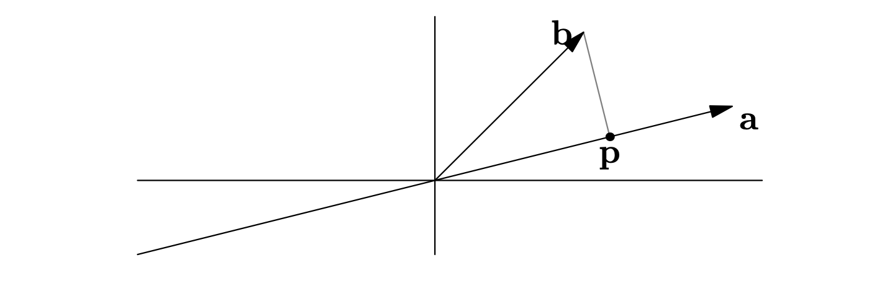

我们有向量 $b$ 和在一条直线上的向量 $a$，如果我们想找到 $b$ 在直线上最近的点，可以由 $b$ 向直线作垂线交于点 $p$。

> 为了便于推导投影的公式，我们需要做如下的假设：
>
> 误差向量（Error）：$e=b-p$
>
> 投影向量：$p=xa$ 其中 $x$ 是一个标量，而 $p$ 与 $a$ 是向量
>
> 代入得：$e=b-xa$

## 误差向量与直线垂直（$e\bot a$）

如标题所言，这是投影的一个关键特征，我们需要使用这个特征来计算 $x$ 与 $p$。

因为 $e$ 与 $a$ 正交，因此它们点乘的积为0：

$a^Te=a^T(b-xa)=0$

$xa^Ta=a^Tb$

$x=\frac{a^Tb}{a^Ta}$

代入 $p$ 可以得到：

$p=ax=a\frac{a^Tb}{a^Ta}$

**可知：** $b$ 变长一倍会导致 $p$ 也变长一倍，但是 $a$ 变长一倍不会影响 $p$ 的长度。

## 投影矩阵（Projection Matrix）

我们在上一步得到的投影向量的结论看起来很复杂，因此，推荐将其写作以下形式：

$p=Pb$ 其中 $P$ 是投影矩阵。

因为 $p=\frac{aa^T}{a^Ta}b$；

我们可以得到 $P=\frac{aa^T}{a^Ta}$ (请注意，$aa^T$ 是一个矩阵而不是一个数字；矩阵的乘法没有交换律，因此分子分母不可抵消)。

### 高维空间的投影

在 $\mathbb{R}^3$ 空间中，如果想要将向量 $b$ 投影到一个平面上最近的点 $p$，与在二维平面上的操作类似。

如果 $a_1$ 与 $a_2$ 形成平面的一个基，则这个平面是矩阵 $$A=\begin{bmatrix}
a_1 & a_2
\end{bmatrix}$$ 的列空间。

因为投影向量是这个平面空间中的一个向量，因此可以设为 $p=\hat{x}_1a_1+\hat{x}_2a_2=A\hat{x}$。

误差向量：$e=b-p=b-A\hat{x}$ （误差向量正交于投影的平面）

由**误差向量与平面垂直**可得：$a_1^Te=0$ 与 $a_2^Te=0$

代入 $e=b-A\hat{x}$ 并将上面两个式子用矩阵表示：

$A^T(b-A\hat{x})=0$ 

> 1. **此形式在二维平面也成立**
>
> 如果我们将 $b$ 投影到一个直线上，矩阵 $A$ 则只有一列。此时上式即为：$a^T(b-xa)=0$，与我们先前在二维空间得到的相同。
>
> 2. **从列空间与左零空间的角度理解此式**
>
> 因为 $A^Te=0$，我们可以得到 $e$ 是 $A^T$ 的零空间，即 $A$ 的左零空间。
>
> 已知左零空间与列空间正交，所以他们相乘理应为 0。

#### 高维空间的投影矩阵

$p=Pb=A\hat{x}$，我们将导出 $P$ 与 $A$ 的关系式。

将 $A^T(b-A\hat{x})=0$ 重写为 $A^TA\hat{x}=A^Tb$。

$\hat{x}=(A^TA)^{-1}A^Tb$

$p=A\hat{x}=A(A^TA)^{-1}A^Tb$

$P=A(A^TA)^{-1}A^T$

**注意：** 这个公式无法再进行化简，因为如果 $A$ 不是方阵，则 $(A^TA)^{-1}$ 不等于 $A^{-1}(A^T)^{-1}$。若 $A$ 确实是方阵，那么我们可以得到 $P$ 是单位矩阵。

### 投影矩阵的性质

- 已知对于任意的向量 $b$，$Pb$ （即投影向量）是一个位于向量 $a$ 直线上的一个向量，因此我们可以得到 $P$ 的列空间是被向量 $a$ 填充的（spanned）。

> **为什么通过 $Pb=xa$ 可以得到 $P$ 的列空间是被向量 $a$ 填充的？**
>
> 矩阵与一个向量的乘法（即 $Pb$）可以看作是根据向量 $b$ 对 $P$ 的所有列进行线性组合。因为相乘的结果（即线性组合的结果）总是位于 $a$ 扩展所形成的空间中（即向量 $xa$），所以可以得到上述结论。
>
> *The column space of $P$ is spanned by $a$ because for any $b$，$Pb$ lies on the line determined by $a$.*

- 因为投影矩阵的列空间是被向量 $a$ 所填充的，所以 $P$ 的秩为 $a$ 的维度（被投影矩阵的列空间的维度）。

- 投影矩阵是对称矩阵（$P^T=P$）。

> **证明投影矩阵是对称矩阵。**
>
> $P=A(A^TA)^{-1}A^T$
>
> $P^T=(A(A^TA)^{-1}A^T)^T=A^{TT}((A^TA)^{-1})^TA^T=A((A^TA)^{-1})^TA^T$
>
> *请注意，$(A^TA)^{-1}$ 是一个对称矩阵。因为 $(A^TA)$ 是对称矩阵，$((A^TA)(A^TA)^{-1})^T=I^T\to (A^TA)^{-1T}(A^TA)^T=I^T\to (A^TA)^{-1T}(A^TA)=I$，由于我们知道 $(A^TA)$ 的逆矩阵（或者说能与此矩阵相乘为单位矩阵）的矩阵是唯一的，因此 $(A^TA)^{-1T}=(A^TA)^{-1}$。*
>
> 因此 $P^T=A((A^TA)^{-1})^TA^T=A(A^TA)^{-1}A^T=P$。

- 投影矩阵的幂是它本身（$P^2=P$），进一步可得 $P^2b=Pb$。

> **从投影视角解释投影矩阵的幂的不变性。**
>
> $P^2b=PPb=Pp$
>
> 由于向量 $b$ 的投影向量（即 $p=Pb$ ）已经位于向量 $a$ 所在的直线上了。因此投影向量的再投影仍然是它本身。

## 投影的作用：寻找方程 $Ax=b$ 最近似的解

我们知道投影可以找到一个向量与某个直线的最小距离。若 $Ax=b$ 无解，由于 $Ax$ 始终在 $A$ 的列空间中，而 $b$ 可能不在这个列空间中，我们可以将 $b$ 投影到 $p$ 然后求解 $A\hat{x}=p$。此时，$A\hat{x}$ 即是 $b$ 在 $A$ 的列空间中的投影向量，是 $A$ 的列空间中与 $b$ 误差最小的值。

> 使用矩阵 $A$ 不便于理解，可以将矩阵 $A$ 简单看作向量 $a$。 
>
> 
>
> 此时，$b$ 是原始的目标值，因为 $x$ 无论取何值，$xa$ 都在 $a$ 所在的直线上。因此我们可以找到 $b$ 在直线上的投影向量，即 $p$ 来作为 $b$ 的最佳近似值。这里 $p=\hat{x}a$。

# 最小二乘（Least Squares）

假设我们在 $(t,b)$ 坐标系中有这三点：${(1,1),(2,2),(3,2)}$。我们想找到最接近的一条线 $b=C+Dt$ 用于拟合这三个点。

则我们可以列方程组：

$C+D=1$

$C+2D=2$

$C+3D=2$

写成矩阵的形式：

$Ax=b$

$\begin{bmatrix} 1 & 1 \\ 1 & 2 \\ 1 & 3 \end{bmatrix}\begin{bmatrix} C \\ D \end{bmatrix}=\begin{bmatrix} 1 \\ 2 \\ 2 \end{bmatrix}$

因为我们无法找到一条线能同时穿过给定的三个点，因此这个方程组是无解的。

然而我们可以将 $b$ 投影到 $A$ 的列空间上得到最小误差的解 $p=A\hat{x}$。

根据误差向量与 $A$ 的列空间正交，我们可以得到：

$A^T(A\hat{x}-b)=0$

进一步化简：$A^TA\hat{x}=A^Tb$。

此时我们可以求解 $\hat{x}$：$\hat{x}=(A^TA)^{-1}A^Tb$
    

# 标准正交矩阵（Orthonormal Matrix）

**标准正交（Orthonormal，或译作正交归一）** 要求正交向量的长度均为 1，即满足：

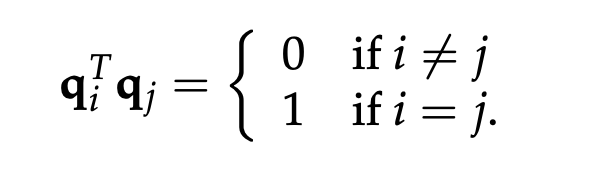

如果矩阵 $Q$ 的列是由**标准正交向量**构成的，即 $\begin{bmatrix} q_1 & \cdots  & q_n \end{bmatrix}$ ，那么 $Q^TQ=I$。

由标准正交向量组成的列的矩阵是一类新的矩阵，称之为**标准正交矩阵**。

> 其他的矩阵类型如：
>
> - 三角矩阵（triangular）
> - 对角线矩阵（diagonal）
> - 排列矩阵（permutation）
> - 对称矩阵（symmetric）
> - 最简阶梯型矩阵（reduced row echelon form, rref）
> - 投影矩阵（projection matrix）

## 正交矩阵（Orthogonal Matrix） 

如果一个标准正交矩阵是**方阵**，那么可以将其称作**正交矩阵**。如果 $Q$ 是方阵，那么 $Q^TQ=I$ 意味着 $Q^T=Q^{-1}$。

**注意：** 正交矩阵是标准正交矩阵的子集。

### 构造正交矩阵

三角函数的正交矩阵：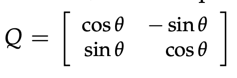

对于非正交矩阵：$\begin{bmatrix} 1 & 1 \\ 1 & -1 \end{bmatrix}$，我们可以通过乘以一个系数来使它正交化，即 $\frac{1}{\sqrt{2}}\begin{bmatrix} 1 & 1 \\ 1 & -1 \end{bmatrix}$

## 标准正交矩阵的投影

设 $Q$ 是标准正交矩阵。

则 $Q$ 的投影矩阵是：$P=Q(Q^TQ)^{-1}Q^T$

因为标准正交矩阵的性质，可以得到 $Q^TQ=I$，因此 $P=QQ^T$。

若 $Q$ 为方阵，即正交矩阵，则 $Q^T=Q^{-1}$，可得 $P=I$。

### 简化最小二乘的计算

最小二乘的正规方程是：$A^TA\hat{x}=A^Tb$

当矩阵 $A$ 是标准正交矩阵，我们可以得到 $\hat{x}=Q^Tb$。

因此，$\hat{x}_i=q_i^{T}b$

# Gram-Schmidt 正交法

Gram-Schmidt（格拉姆-施密特）正交法的目标类似于高斯消元法。在使用高斯消元法时，我们的目标是构造上三角矩阵，而 Gram-Schmidt 正交法的目标是构造**标准正交矩阵**。

## 构造正交向量的过程

假设我们有两个**线性独立**的向量 $a$ 与 $b$ 的向量，基于这两个向量构成的**向量空间**，我们意图使用 Gram-Schmidt 法构造同在这个空间的两个**标准正交**向量 $q_1$ 与 $q_2$。

因为标准正交向量的长度为 1，我们可以先找到对应的两个正交向量 $A$ 与 $B$。之后，我们就可以归一化它们得到：$q_1=\frac{A}{||A||}$ 与 $q_2=\frac{B}{||B||}$。

为了得到这两个正交向量，我们可以使用投影的方式。因为我们已知：**误差向量 $e$ 正交于矩阵 $A$ 的列空间。**

让 $A=a$，我们可以得到正交于 $A$ 的向量 $B=b-p$ （此处的 $B$ 即为误差向量）。

$p=xA=\frac{A^TB}{A^TA}A$

$B=b-\frac{A^TB}{A^TA}A$

$A$ 与 $B$ 的点积应该为 0，通过将上式左右同时左乘 $A^T$，我们经计算可以得到 $A^TB=0$。

> **计算 $A^TB=A^Tb-A^T\frac{A^TB}{A^TA}A$**
>
> 应注意，$\frac{A^TB}{A^TA}$ 是标量 $x$，因此我们可以将右式改写为：$A^TB-\frac{A^TB}{A^TA}A^TA$。
>
> 因为 $A$ 是向量，因此 $A^TA$ 也是标量，化简后右式可以计算为 0。

### 构造多个正交向量

假如我们有 3 个线性独立的向量 $a$、$b$ 和 $c$，我们如何找到三个正交的向量 $A$、$B$ 和 $C$ ？

构造 $A$ 与 $B$ 的方式同上。而构造 $C$ 的方式与 $B$ 类似，我们只需要找到同时垂直于 $A$ 与 $B$ 的误差向量即可：

$C=c-\frac{A^Tc}{A^TA}A-\frac{B^Tc}{B^TB}B$

> **正交向量的另一种构造方式： $C=c-P_Qc$**
>
> 我们先前了解到的构造方式是使用给定的独立向量（例如 $c$）依次减去我们已经得到的正交的向量（即求出与这些正交的向量垂直的误差向量）。
>
> 而另一种方式是，计算这些正交向量为列空间组成的正交矩阵 $Q$ 的**投影矩阵** $P_Q$，那么 $P_Qc$ 就是将独立向量投影到这个正交矩阵的列空间。此时我们只需要使用 $c$ 减去 $c$ 投影到正交矩阵列空间之后的投影向量即可。
>
> 注意，这些独立向量 $a,b,c$ 构成的矩阵 $A$ 的投影矩阵 $P_A$ 等于 $P_Q$（因为它们都将向量投影到同一个子空间），因此我们也可以写成：$C=c-P_Ac$。

### 示例

假设 $a=\begin{bmatrix} 1 \\ 1 \\ 1 \end{bmatrix}$，$b=\begin{bmatrix} 1 \\ 0 \\ 2 \end{bmatrix}$

设 $A=a$，

$B=b-xA=\begin{bmatrix} 1 \\ 0 \\ 2 \end{bmatrix}-\frac{A^Tb}{A^TA}\begin{bmatrix} 1 \\ 1 \\ 1 \end{bmatrix}$

计算可得：$B=\begin{bmatrix} 0 \\ -1 \\ 1 \end{bmatrix}$

经过归一化，我们可以得到：

$Q=\begin{bmatrix} q_1 & q_2 \end{bmatrix}=\begin{bmatrix} 1/\sqrt{3} & 0 \\ 1/\sqrt{3} & -1/\sqrt{2} \\ 1/\sqrt{3} & 1/\sqrt{2} \end{bmatrix}$

## $A=QR$

类似于高斯消除后得到的 $A=LU$ 分解，经过 Gram-Schmidt 正交化后我们可以得到 $A=QR$ 分解。

$Q$ 是标准正交向量为列的矩阵，而 $R$ 是一个**上三角矩阵**。

通过 $R=Q^TA$ （$Q^T=Q^{-1}$）我们可以计算 $R$：

$A=QR$

$\begin{bmatrix} a_1 & a_2 \end{bmatrix}=\begin{bmatrix} q_1 & q_2 \end{bmatrix}\begin{bmatrix} a_1^Tq_1 & a_2^Tq_1 \\ a_1^Tq_2 & a_2^Tq_2 \end{bmatrix}$

> **为什么 $R$ 是上三角矩阵？**
>
> 在上式中，为了计算 $q_2$，我们需要计算误差向量 $e$ 以保证得到的向量与前一个向量垂直（在之前的例子中是使 $B$ 垂直于 $A$）。因此 $q_2$ 一定与 $a_1$ 正交。推广之后可以发现，若有多个向量，$q_i$ 一定与 $a_1...a_{i-1}$ 都正交。

# 行列式（Determinants）

行列式是一个与方阵有关的数字，写作 $detA$ 或 $|A|$。当行列式不为 0 时，我们可以肯定这个矩阵是可逆的。

## 行列式的性质

已知 $\begin{vmatrix} a & b \\ c & d \end{vmatrix}=ad-bc$，我们可以得到以下适用于任意形状方阵的属性。

1. $detI=1$

2. 交换矩阵的两行会改变其行列式的符号（变换正负）。

   由此属性可以得知对于同一个矩阵，进行偶次数的行交换一定不同于其进行奇次数行交换得到的矩阵。

2. 线性特征

   (a) 如果矩阵的一行乘以 $t$，则其行列式也乘以 $t$：$\begin{vmatrix} ta & tb \\ c & d \end{vmatrix}=t\begin{vmatrix} a & b \\ c & d \end{vmatrix}$

   (b) 行列式的行是线性可加的：$\begin{vmatrix} a+a' & b+b' \\ c & d \end{vmatrix}=\begin{vmatrix} a & b \\ c & d \end{vmatrix}+\begin{vmatrix} a' & b' \\ c & d \end{vmatrix}$

> 我们可以由属性 1 推导出： $\begin{vmatrix} 1 & 0 \\ 0 & 1 \end{vmatrix}=1$；由属性 2 推导出：$\begin{vmatrix} 0 & 1 \\ 1 & 0 \end{vmatrix}=-1$。
>
> **引申：** 排列矩阵 $P$ 的行列式为 1 还是 -1 取决于 $P$ 交换行的次数是偶数还是奇数。

我们可以根据这三个属性推导出以下属性：

4. 如果矩阵的两行相同，其行列式为 0。（由属性 2 可得，只有行列式为 0 时，交换相同两行改变符号不改变大小）。

5. 如果 $i\ne j$，行 $j$ 减去 $t$ 倍的行 $i$ 不会改变行列式。

   证明：

   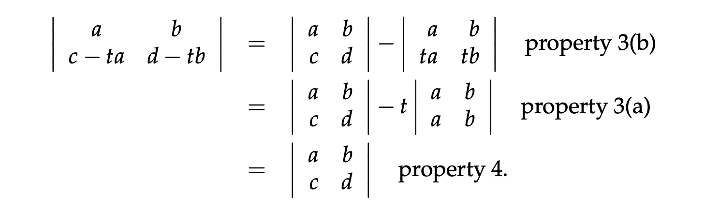
   

6. 如果存在全 0 行，则其行列式为 0。（由属性 3(a) 可得，令 $t=0$）。

7. 上三角矩阵的行列式是对角线的乘积。

> 由属性 5 可得我们可以对上三角矩阵运用消除法使其变成**对角线矩阵**。
   >
> 而由属性 3(a) 我们可以知道对角线矩阵的行列式等于对角线的乘积乘以单位矩阵。
   >
> 最后结合属性 1，我们可以证明此属性。

8. 当矩阵是奇异矩阵（存在线性相关的行/列）时行列式为 0。

9. $detAB=(detA)(detB)$

> 我们可以由此属性推导出逆矩阵的行列式：$detA^{-1}=\frac{1}{detA}$
   >
> 因为 $A^{-1}A=1$ （若 $A$ 是奇异矩阵，则 $A^{-1}$ 不存在，且其行列式是未定义的）。
   >
> 同时，我们也可以推导出：$A^2=(detA)^2$ 以及 $det2A=2^ndetA$ （因为行列式每一行乘以的常数都可以提取出来，一共有 $n$ 行，因此每一行的常数都提取出来，可以写成乘以 $n$ 次）。

10. $detA^T=detA$

    $\begin{vmatrix} a & b \\ c & d \end{vmatrix}=\begin{vmatrix} a & c \\ b & d \end{vmatrix}=ad-bc$

    > 由此属性，我们可以将第 2、3、4、5、6 属性涉及**行**的描述应用于**列**上。
    >
    > 为了证明此属性，我们可以使用消除法做分解：$A=LU$，则 $|U^TL^T|=|U^T||L^T|$。又因为矩阵 $L$ 是下三角矩阵，其对角线全为 1，通过属性 5 进行消除后可得 $|L|=|L^T|=1$，同理 $|U|=|U^T|$。

## 行列式的公式推导

通过上述的 10 条行列式属性，我们可以推导出行列式的计算公式。

### 2 ✕ 2 行列式

已知：

- $detI=1$
- 交换两行会改变行列式的符号
- 行列式的行是线性可加的

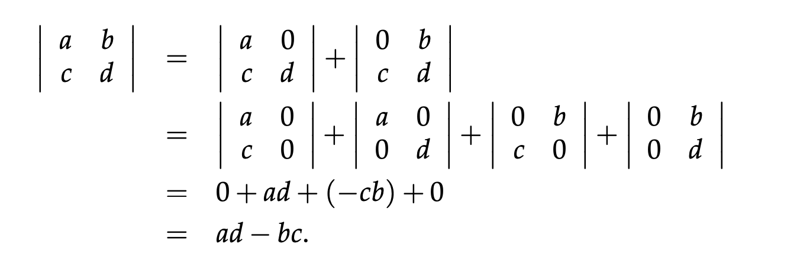

### 3 ✕ 3 行列式

类似于 2 ✕ 2 行列式的计算方式，我们仍然使用行线性可加的特性分解行列式。

但是分解后一共会有 $3\times 3\times 3=27$ 个项。我们可以只保留不为 0 的项（即不存在全 0 行或全 0 列的项）：

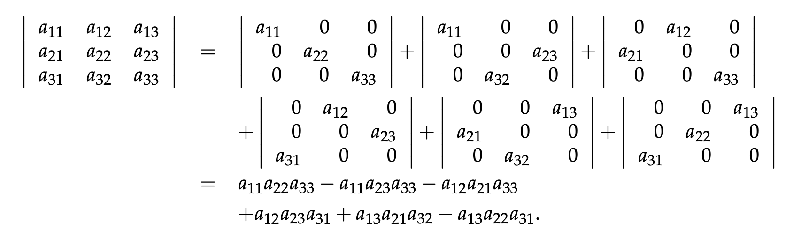

## 代数余子式（Cofactor）

代数余子式可以帮助将复杂的行列式公式化简。

对于一个行列式，我们可以将其转写为如下公式：

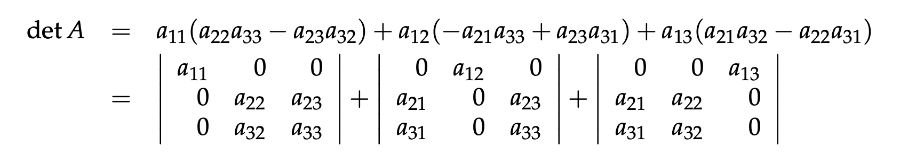

如果我们将去掉 $i$ 行 $j$ 列的行列式的计算结果用 $C_{ij}$ 表示，并令 $C_{ij}$ 的符号由 $i+j$ 的奇偶性决定，则 $n\times n$ 行列式可以写为：

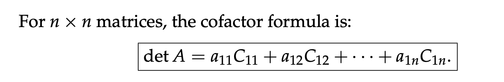

其中，$C_{ij}=(-1)^{i+j}M_{ij}$。

此即，**代数余子式公式（Cofactor Formula）** 或拉普拉斯展开（按第一行展开）。

> **余子式（Minor）$M_{ij}$**
>
> 上述公式的 $M_{ij}$ 表示矩阵 $A$ 的余子式，其值为矩阵 $A$ 删掉 $i$ 行 $j$ 列后得到的子矩阵的行列式。

### 利用代数余子式计算大型行列式

对于如下的三对角线矩阵（Tridiagonal Matrix）：

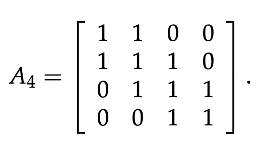

为了计算其行列式，我们可以从第一行运用代数余子式公式。

$detA_4=1\cdot \begin{vmatrix} 1 & 1 & 0 \\ 1 & 1 & 1 \\ 0 & 1 & 1 \end{vmatrix}-1\cdot \begin{vmatrix} 1 & 1 & 0 \\ 0 & 1 & 1 \\ 0 & 1 & 1 \end{vmatrix}$

对于第一项我们可以使用萨律法（Sarrus Rule）计算，而对于第二项，可以从第一列使用代数余子式公式更快的得到结果：

$detA_4=1\times detA_3 - 1\times detA_2=-1$。

> **三对角线矩阵的行列式规律**
>
> 我们可以总结规律：$|A_n|=|A_{n-1}|-|A_{n-2}|$。
>
> 其每六项都是一个重复的序列：
>
> 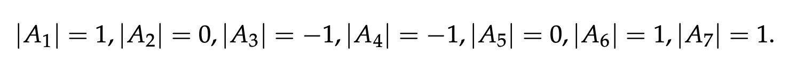

### 使用代数余子式计算逆矩阵

对于逆矩阵 $A^{-1}$，有以下公式：

$A^{-1}=\frac{C^T}{detA}$

其中，$C^T$ 是矩阵 $A$ 的**伴随矩阵（Adjoint Matrix）**（每一项都由 $C_{ij}$ 表示的矩阵的转置）。

## 克莱姆法则（Cramer's Rule）

**推导过程：**

已知：

- 如果 $A$ 是非奇异矩阵，则由 $Ax=b$ 可得 $x=A^{-1}b$
- $A^{-1}=\frac{C^T}{detA}$

则：

$x=\frac{1}{detA}C^Tb$

展开 $C^Tb$ 可得：

$\begin{bmatrix} C_{11}b_1+\cdots +C_{n1}b_n \\ \vdots  \\ C_{1n}b_1+\cdots +C_{nn}b_n \end{bmatrix}$

根据**代数余子式公式**，可以发现 $C^Tb$ 的第 $j$ 行即某个矩阵按第 $j$ 列展开的行列式。

并且可以推断出，这个矩阵的第 $j$ 列应为 $b_1$ 到 $b_n$，且除了第 $j$ 列以外，其他的元素应与矩阵 $A$ 完全一样（因为 $C$ 是矩阵 $A$ 的伴随矩阵）。

由此可知，若设 $C^Tb$ 第 $j$ 行的值等于新的矩阵 $B_j$ 的行列式，那么 $x$ 的第 $j$ 个分量应为：

$x_j=\frac{detB_j}{detA}$

其中 $B_j$ 为：

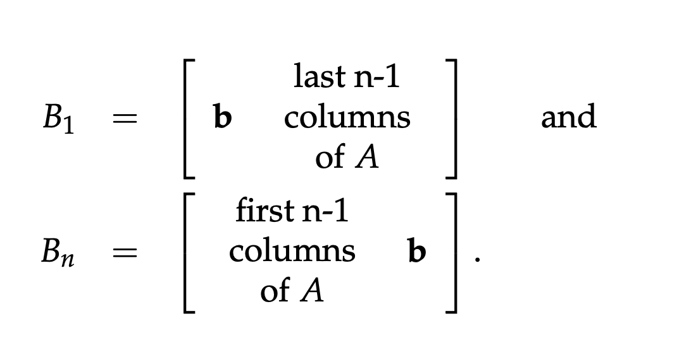

克莱姆法则虽然计算效率很低，但是可以给予关于代数余子式与矩阵的启发。

## $|detA|=Volume$

若 $A$ 的每一行（或每一列，不管是行还是列，得到的体积数值都是相等的）都是构成平行六面体的向量，则 $|detA|$ （即矩阵的行列式的绝对值）是这个图形的体积。

> 在微积分中已经通过代数方式证明了 $2\times 2$ 的行列式是平面平行四边形的面积；$3\times 3$ 的行列式是空间平行六面体的体积。

### 体积的缩放与行列式有关

1. 由行列式属性 3(a) 可得：如果行列式的某一行（图形的某个边）乘以 2，则图形体积加倍。

2. 由行列式属性 3(b) 可得：行列式的某一行（构成图形一个边的向量）是线性可加的，即我们可以通过计算两个图形的体积（面积），并求它们的和来得到最终图形的体积（面积）。

![[assets/image-20250521151813431.png]]

   也可以通过几何的方式得到证明：

![[assets/image-20250521151910542.png]]

### 由坐标计算体积

如果我们知道了图形每个顶点的坐标，例如某个三角形的顶点是 $(x_1,y_1)$、$(x_2,y_2)$、$(x_3,y_3)$，我们可以使用以下行列式计算其面积：

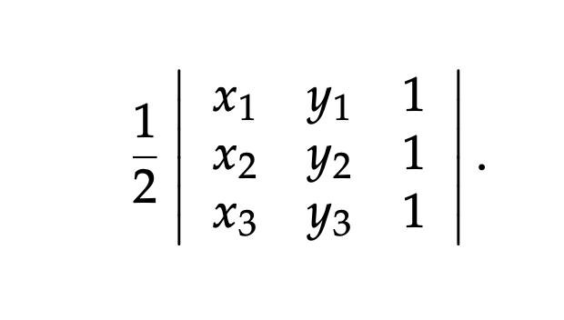

此行列式使用代数余子式展开后的式子与使用两个向量边组成的行列式的展开相同。
