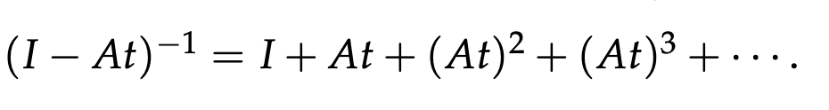

# Unit 2.5: Eigenvalues, Eigenvectors and Fourier Series

此文档包含 Unit 2 的剩余部分：特征值与特征向量、矩阵的对角化以及它们的应用（差分方程、斐波那契数列、微分方程以及马尔可夫矩阵）；另外包含向量正交的延伸——傅里叶级数。

# 特征值与特征向量（Eigenvalues & Eigenvectors）

将矩阵 $A$ 与向量 $x$ 相乘看作是一个函数（输入 $x$，输出 $Ax$），特征向量就是使 $Ax$ 与 $x$ 平行的向量，即：

$Ax=\lambda x$

上式中，$x$ 是 $A$ 的特征向量，$\lambda$ 是 $A$ 的特征值。

> **特征向量在投影（Projection）中的例子**
>
> 设 $P$ 是投影到一个平面的投影矩阵。
>
> - 对于任何在此平面的向量 $x$，可以得到：$Px=x$。$x$ 是特征向量，且 $\lambda=1$。
> - 对于任何垂直于此平面的向量 $x$，可以得到：$Px=0$。$x$ 是特征向量，且 $\lambda=0$。
>
> 因为 $P$ 的特征向量包含了 $\mathbb{R}^3$ 的基底，因此其特征向量填充了整个空间。

## 特征值的属性

已知特征值的属性：

- $n\times n$ 的矩阵有 $n$ 个特征值
- 特征值的**和**等于矩阵对角线的和，即矩阵的**迹（Trace）**
- 特征值的**积**等于矩阵的**行列式**

因此对于一个 $2\times 2$ 的矩阵，已知一个特征值，我们可以根据以上的属性求出第二个特征值。

## $det(A-\lambda I)=0$

已知 $Ax=\lambda x$，为了求解特征值和特征向量，我们可以做以下代数运算：

$Ax=\lambda x$

$(A-\lambda I)x=0$

因为特征向量 $x\ne 0$，因此上式必须有非零解，即矩阵 $(A-\lambda I)$ 的 RREF 式必须有自由变量 -> $(A-\lambda I)$ 是奇异矩阵 -> $det(A-\lambda I)=0$。

接下来，我们可以依次求解特征值与特征向量：

- **求解特征值：** 通过求解最后推导出来的这个方程（**特征方程**，Characteristic Equation），我们可以得到 $n$ 个解，每个解都是矩阵 $A$ 的一个特征值（可能存在**重复解**）。

- **求解特征向量：** 每求解一个特征值，将其代入 $(A-\lambda I)x=0$，并求解此方程（即求解零空间），即可找到此特征值对应的特征向量。

### 示例：求解特征值与特征向量

**请注意：** 以上求得的特征方程的参数 6 对应着矩阵 $A$ 的迹，而 8 对应着矩阵 $A$ 的行列式，我们可以总结特征方程的结构如下：

$\lambda^2-trace(A)\cdot \lambda+detA=0$

1. 求解特征方程

   求解特征方程，可以得到两个解：$\lambda_1=4,\ \lambda_2=2$。

2. 求解零空间

   已知所有的特征值，我们可以通过求解零空间得到对应的特征向量。

   对于 $\lambda_1=4$，代入可得：，易得 $x_1=\begin{bmatrix} 1 \\ 1 \end{bmatrix}$

   对于 $\lambda_2=2$，代入可得：，易得 $x_2=\begin{bmatrix} -1 \\ 1 \end{bmatrix}$

### 矩阵的对角线与特征向量

当我们计算 $B=\begin{bmatrix} 0 & 1 \\ 1 & 0 \end{bmatrix}$ 的特征向量，会发现其与 $A=\begin{bmatrix} 3 & 1 \\ 1 & 3 \end{bmatrix}$ （$A=B+3I$）相同。

因为 $Ax=(B+3I)x=\lambda x+3x+(\lambda + 3)x$，所以它们的特征向量相同，而特征值差 3。

## $A^T$ 的特征值

$A^T$ 的特征值与 $A$ 的特征值相同。

**证明**

计算矩阵特征值时，我们需要求解特征方程：$det(A-\lambda I)$。

而对于 $A^T$，我们可知：$det(A^T-\lambda I)=det((A-\lambda I)^T)$

由行列式的性质 10，我们可知 $detA^T=detA$，则 $det((A-\lambda I)^T)=det(A-\lambda I)=det(A^T-\lambda I)$。

因此 $A^T$ 与 $A$ 的特征方程相同，即特征值相同。

## 复数特征值（Complex Eigenvalues）

矩阵 $Q=\begin{bmatrix} 0 & -1 \\ 1 & 0 \end{bmatrix}$ 可以将所有位于平面上的向量旋转 90°。

因此它唯一的实数特征向量是零向量，其他向量的方向都会被 $Q$ 改变。

**$Q$ 的特征值计算：**

无实数解，复数解为 $\lambda_1=i,\ \lambda_2=-i$。如果矩阵有一复数特征值 $a+bi$，则其共轭复数（Complex Conjugate） $a-bi$ 也是特征值。

## 对称性与特征值

1. **对称矩阵**全为**实数**特征值，**非对称矩阵**拥有**复数**特征值也可能拥有实数特征值。

> 对于非对称矩阵，如 $Q$，其 $A^T=-A$，则其所有的特征值都是复数。

2. **对称矩阵**的特征向量是**正交**的。（可由对阵矩阵的性质 $A^T=A$ 进而证明。）

## 三角矩阵（Triangular Matrices）的特征值

对于如 $A=\begin{bmatrix} 3 & 1 \\ 0 & 3 \end{bmatrix}$ 的上三角矩阵，其特征值就是对角线上的数值。

验证：

因此 $\lambda_1=3,\ \lambda_2=3$。

**特征向量的计算：**因为两个特征值相同，代入 $(A-\lambda I)x$ 可得：

可得 $x_1=\begin{bmatrix}1\\0\end{bmatrix}$，且无其他的独立特征向量。

# 矩阵的对角化（Diagonalization）与幂（Power）

任何拥有 $n$ 个**独立特征向量**的矩阵都可以被对角化，而且对角化可以帮助简化运算。

## $S^{-1}AS=\Lambda$

若 $A$ 有 $n$ 个线性独立的特征向量，我们可以将它们全部以**列**为单位放进一个矩阵 $S$ 这个中 （则矩阵 $S$ 将是方阵且可逆）。

$AS=A\begin{bmatrix} x_1 & x_2 & \cdots  & x_n \end{bmatrix}=\begin{bmatrix} \lambda_1 x_1 & \lambda_2 x_2 & \cdots  & \lambda_n x_n \end{bmatrix}$  *因为 $Ax=\lambda x$，所以矩阵 $A$ 与矩阵 $S$ 的每一列相乘都会得到 $\lambda_i x$。*

将特征值提出来，我们可以得到：
$S\begin{bmatrix} \lambda_1 & 0 & \cdots & 0 \\ 0 & \lambda_2 & 0 & 0 \\ \vdots &  & \ddots & \vdots  \\ 0 & \cdots & 0 & \lambda_n \end{bmatrix}=S\Lambda$

### 计算 $\Lambda$

因为 $S$ 是可逆矩阵，因此我们可以通过上式两边同时左乘 $S^{-1}$ 来得到 $\Lambda$。

$\boxed{S^{-1}AS=\Lambda}$

相等地，$\boxed{A=S\Lambda S^{-1}}$。

## 矩阵的幂与特征值的关系

我们好奇：$A^2$ 的特征值与特征向量

由于已知：$Ax=\lambda x$

可以得到：$A^2x=\lambda Ax=\lambda^2x$

**结论：**

1. $A^2$ 的特征值等于 $A$ 的特征值的平方
2. $A^2$ 的特征向量等于 $A$ 的特征向量

### 对角线分解与矩阵的幂

我们已知矩阵的对角线分解为：$A=S\Lambda S^{-1}$

则其平方可得：$A^2=S\Lambda S^{-1}S\Lambda S^{-1}=S\Lambda^2 S^{-1}$ （注意，中间的 $S^{-1}S$ 项被化简为了单位矩阵）。

由此，我们可以得到矩阵的幂与对角线分解的关系：$\boxed{A^k=S\Lambda^k S^{-1}}$

由上结论，我们可以推导出**定理**：如果 $A$ 有 $n$ 个独立的特征向量与特征值 $\lambda_i$，那么当 $k\to\infty$ 时 $A^k\to0$，当且仅当所有的 $|\lambda_i|\lt 1$。

> **矩阵何时有 $n$ 个独立的特征向量？**
>
> 当 $A$ 的所有特征值都不同时，我们可以说 $A$ 有 $n$ 个独立的特征向量（且可以被对角化）。
>
> 
>
> **特例**
>
> **单位矩阵**的特征值全为 1，但是其独立的特征向量有 $n$ 个。
>
> 因为 $Ix=1\cdot x$，可知任何位于 $\mathbb{R}^n$ 空间内的向量都是它的特征向量，此空间下有 $n$ 个线性无关的基。

# 差分方程： $u_{k+1}=Au_k$

设一系列向量，每一个向量都是 $A$ 乘以前一个向量：$u_{k+1}=Au_k$。

上式即被称作一阶差分方程（First Order Difference Equation）。将其展开直到 $u_0$ 项后，可知这个方程系统的解为：$u_k=A^ku_0$。

## 特征值分解法

借助特征值分解法我们可以推导出更简单的差分方程公式。

**前提条件：$A$ 有 $n$ 个线性无关的特征向量。**

将 $u_0$ 写作 $A$ 的特征向量的组合：$u_0=c_1x_1+c_2x_2+...+c_nx_n=Sc$。

同时左乘 $A$：$Au_0=c_1\lambda_1x_1+c_2\lambda_2x_2+...+c_n\lambda_nx_n$

由矩阵的幂与特征值的关系，得到**一阶差分方程与特征值的换算等式**：$u_k=A^ku_0=c_1\lambda^k_1x_1+c_2\lambda^k_2x_2+...+c_n\lambda^k_nx_n=\Lambda^kSc$

# 斐波那契数列（Fibonacci Sequence）

斐波那契数列：$0,1,1,2,3,5,8,13,...$，通式：$F_{k+2}=F_{k+1}+F_k$。我们可以使用特征值表示这个。

已知一阶方程（$u_{k+1}=Au_k$）使用特征值表示的方法，我们可以使用技巧将二阶方程 $F_{k+2}=F_{k+1}+F_k$ 变换成一阶方程组：

设 $u_k=\begin{bmatrix} F_{k+1} \\ F_k \end{bmatrix}$，则：

$F_{k+2}=F_{k+1}+F_k$

$F_{k+1}=F_{k+1}$

等同于一阶方程：

$u_{k+1}=\begin{bmatrix} 1 & 1 \\ 1 & 0 \end{bmatrix}u_k$

而且我们已知这个方程的解是：

$u_{k}=\begin{bmatrix} 1 & 1 \\ 1 & 0 \end{bmatrix}^k u_0$

## 特征值与斐波那契数列的增长率

经过计算，可以得到矩阵 $\begin{bmatrix} 1 & 1 \\ 1 & 0 \end{bmatrix}$ 的特征值为：$\frac{1+\sqrt{5}}{2}\approx1.618$ 与 $\frac{1-\sqrt{5}}{2}\approx-0.618$。

我们已知

$u_{k}=\begin{bmatrix} 1 & 1 \\ 1 & 0 \end{bmatrix}^k u_0$

这里有两种方式理解数列增长率与特征值的关系：

1. 使用**差分方程**中推导的方式，将 $u_0$ 写作特征向量的线性组合，并左乘 $A^k$可得：$u_k=A^k u_0=c_1 \lambda_1^kx_1+c_2 \lambda_2^k x_2$。

   由于 $\lambda_2=0.618\lt 1$，因此上式第二项会逐渐趋于 0。因此斐波那契数列的增长率与 $\lambda_1$ 有关。

   

2. 因为得到的两个特征值不同，意味着矩阵的 2 个线性独立的特征向量，因此可以将其**对角线分解**。

   分解可得：$A^k=S\Lambda^kS^{-1}$，此式可以得到矩阵的幂与特征值的关系。随着 $k$ 的增大，矩阵 $\Lambda$ 对角线的特征值项会变化，即 $\lambda_2$ 趋于 0，$\lambda_1$ 持续增大。相应的 $A$ 的增长率也仅与 $\lambda_1$ 有关。

## 序列的闭式解（Closed Form Expression）

虽然斐波那契数列是一个无穷项数列，但是我们可以借助一阶差分方程与特征值的关系，得到斐波那契数列的闭式解。

要得到 $F_k$ 的值，可以从 $u_k$ 获得线索。

$u_k=\begin{bmatrix} F_{k+1} \\ F_k \end{bmatrix}=A^ku_0=c_1\lambda_1^kx_1+c_2\lambda_2^kx_2$

我们需要求出特征向量与系数常量的值。

1. **计算特征向量**

上式为 0，可得 $x=\begin{bmatrix} \lambda \\ 1 \end{bmatrix}$，即 $x_1=\begin{bmatrix} \lambda_1 \\ 1 \end{bmatrix},x_2=\begin{bmatrix} \lambda_2 \\ 1 \end{bmatrix}$。

2. **计算系数常量**

$u_0=\begin{bmatrix} F_1 \\ F_0 \end{bmatrix}=\begin{bmatrix} 1 \\ 0 \end{bmatrix}=c_1\lambda_1^0x_1+c_2\lambda_2^0x_2=c_1x_1+c_2x_2$

由上式方程组解得：$c_1=-c_2=\frac{1}{\sqrt{5}}$

最后，我们将特征向量代入 $\begin{bmatrix} F_{k+1} \\ F_k \end{bmatrix}=A^ku_0=c_1\lambda_1^kx_1+c_2\lambda_2^kx_2$：

$F_k=c_1\lambda_1^k+c_2\lambda_2^k$ （请注意，两个特征向量的第二个值均为 1，因此此处省略。）

# 一阶常微分方程

类似于我们使用特征值的特性求解差分方程一样，我们也可以求解如下所示的微分方程组：

$\frac{du_1}{dt}=-u_1+2u_2$

$\frac{du_2}{dt}=u_1-2u_2$

其中，设初始条件：$u_1=1,u_2=0$

或写作向量形式：$u(0)=\begin{bmatrix} 1 \\ 0 \end{bmatrix}$

## 一阶常微分方程的矩阵表示

由上述方程组，设矩阵 $A$：

$A=\begin{bmatrix} -1 & 2 \\ 1 & -2 \end{bmatrix}$

则方程组可写为：

$\frac{du}{dt}=Au$

此微分方程的通解为 $e^{At}u(0)$

## 微分方程中的特征值分解法

因为 $A$ 是奇异矩阵，且迹为 -3，可得两个特征值为：$\lambda_1=0,\lambda_2=-3$

然后求解对应的零空间得到特征向量：$x_1=\begin{bmatrix} 2 \\ 1 \end{bmatrix},x_2=\begin{bmatrix} 1 \\ -1 \end{bmatrix}$

$A$ 有两个线性无关的特征向量，类似于处理差分方程的方式，我们可以将 $u(t)$ 写作特征向量的线性组合：

$u(t)=c_1e^{\lambda_1t}x_1+c_2e^{\lambda_2t}x_2$

如此，$\frac{du}{dt}=c_1\lambda_1e^{\lambda_1t}x_1+c_2\lambda_2e^{\lambda_2t}x_2=Au$

### 求解微分方程的解

向分解后的 $u(t)$ 中代入特征值与特征向量可得通解：

$u(t)=c_1e^{\lambda_1t}x_1+c_2e^{\lambda_2t}x_2=c_1\begin{bmatrix} 2 \\ 1 \end{bmatrix}+c_2e^{-3t}\begin{bmatrix} 1 \\ -1 \end{bmatrix}$

为了求解 $c_1,c_2$，我们可以使用初始条件：$u(0)=\begin{bmatrix} 1 \\ 0 \end{bmatrix}$，所以当 $t=0$ 时：

$\begin{bmatrix} 1 \\ 0 \end{bmatrix}=c_1\begin{bmatrix} 2 \\ 1 \end{bmatrix}+c_2\begin{bmatrix} 1 \\ -1 \end{bmatrix}$

可得：$c_1=c_2=\frac{1}{3}$

解得：$u(t)=\frac{1}{3}\begin{bmatrix} 2 \\ 1 \end{bmatrix}+\frac{1}{3}e^{-3t}\begin{bmatrix} 1 \\ -1 \end{bmatrix}$

### 推导微分方程的稳定态（Steady State）

当 $t\to \infty$，解的后一项趋近于 0，因此稳定态如解的第一项所示：

$u(\infty)=\begin{bmatrix} \frac{2}{3} \\ \frac{1}{3} \end{bmatrix}$

## 特征值与微分方程的稳定性

并不是所有的微分方程都具有稳定态（Steady State）。我们可以通过 $A$ 的特征值来判断微分方程的解是**稳定（Stability，$u(t)$ 趋于 0）**、**稳定态（Steady State，$u(t)$ 收敛于非零稳态）** 还是**发散（Blow Up，$u(t)$ 无限增长）**。

- **稳定：** 若矩阵 $A$ 的所有特征值满足 $Re(\lambda)\lt 0$（特征值的实部小于 0），特征值分解后通解的所有项都会随着 $t$ 的增长而消失（Vanishing），则 $u(t)\to 0$。
- **稳态：** 一个特征值为 0，而其他的特征值都满足 $Re(\lambda)\lt 0$，特征值分解后通解只有特征值为 0 的项（$c_ie^{\lambda_it}x_i$）会随着 $t$ 的增长而不变，其他的项都会消失，则 $u(t)$ 会收敛于一个非 0 的稳定态。（如前面的例子所示。）
- **发散：** 所有的特征值都满足 $Re(\lambda)\gt 0$。

> **由矩阵的迹与行列式推断微分方程的稳定性**
>
> 已知矩阵的迹是特征值之和，矩阵的行列式是特征值之积。
>
> 那么，对于 $2\times 2$ 矩阵，当已知这个矩阵的迹为负数，而其行列式为正数，可以推断其所有的特征值实部都是负数，对应的微分方程的解是稳定的。

## 微分方程中的矩阵对角化

由矩阵对角化，我们已知：

$A=S\Lambda S^{-1}$

那么对于微分方程的通解，是否存在 $e^{At}=Se^{\Lambda t}S^{-1}$？

### 从特征值分解多项式中提取 $S$

回顾之前例子的特征值分解，如下：

$u(t)=c_1e^{\lambda_1t}x_1+c_2e^{\lambda_2t}x_2$

我们可以使用矩阵 $S$ 表示所有的特征向量，使用 $v$ 表示 $e^{\lambda_i t}$，为了便于推导，我们将忽略系数常量 $c$。

得到：$u=Sv$

则：$\frac{du}{dt}=Au=S\frac{dv}{dt}=ASv$

同时左乘 $S^{-1}$：$\frac{dv}{dt}=S^{-1}ASv=\Lambda v$ （由矩阵的对角化分解 $S^{-1}AS=\Lambda$）

### 比较微分方程 $\frac{dv}{dt}=\Lambda v$ 与 $\frac{du}{dt}=Au$ 的通解

此时，我们可以得到微分方程 $\frac{dv}{dt}=\Lambda v$ 的通解：

$v(t)=e^{\Lambda t}v(0)$

进一步推导 $e^{\Lambda t}$ 与 $u(t)$ 的关系：$u(t)=Sv(t)=Se^{\Lambda t}v(0)$

而 $u(t)=Sv(t)$，所以 $v(0)=S^{-1}u(0)$

可得：$u(t)=Se^{\Lambda t}S^{-1}u(0)=e^{At}u(0)$

得证。

## 矩阵指数 $e^{At}$

除了矩阵的对角化分解，我们也可以通过 $e^x$ 的级数定义来证明：$e^{At}=Se^{\Lambda t}S^{-1}$

已知 $e^x$ 的泰勒级数展开为：

将 $x$ 替换为 $At$ 可得：

若 $At$ 的特征值很小，即小于 1（与矩阵范数有关），我们可以将 $e^{At}$ 低阶近似于 $\frac{1}{1-x}$，后者是一个几何级数：

现在，让我们通过泰勒展开式证明 $e^{At}=Se^{\Lambda t}S^{-1}$：

因为 $\Lambda$ 是所有特征值构成的矩阵，因此我们可以得到 $e^{\Lambda t}$：

因为对于一阶常微分的通解  $u(t)=e^{At}u(0)$，因此我们可以由 $e^{At}=Se^{\Lambda t}S^{-1}$ 以及 $e^{\Lambda t}$ 的具体项来以另一种方式发现特征值与微分方程稳定性的关系。

## 二阶微分方程

对于二阶微分方程，如 $y''+by'+ky=0$，我们可以参考斐波那契数列的处理方式，使用向量与矩阵的方式将其转换为一阶方程，即 $u'=Au$ 的形式：

设 $u=\begin{bmatrix} y' \\ y \end{bmatrix}$，那么 $u'=\begin{bmatrix} y'' \\ y' \end{bmatrix}$，此时我们可以得到一阶方程：

$u'=\begin{bmatrix} y'' \\ y' \end{bmatrix}=A\begin{bmatrix} y' \\ y \end{bmatrix}$

其中，可以推断 $A=\begin{bmatrix} -b & -k \\ 1 & 0 \end{bmatrix}$，即：

> **对于 $k$ 阶方程**
>
> 如果我们要将一个 $k\times k$ 阶微分方程做处理，我们会得到一个 $k\times k$ 的矩阵。且此矩阵的第一行是方程的系数，而对角线的其他元素都为 1，剩余元素为 0。

# 马尔科夫矩阵（Markov Matrices）

$A=\begin{bmatrix} 0.1 & 0.01 & 0.3 \\ 0.2 & 0.99 & 0.3 \\ 0.7 & 0 & 0.4 \end{bmatrix}$

这是一个 Markov 矩阵示例。

**特征：** 所有元素都是**非负数**，且每一列和为 **1**。（因为 Markov 矩阵常在概率中被应用。）

此外，我们可以发现，一个 Markov 矩阵的**任意幂**会得到另一个 Markov 矩阵。

## 马尔科夫矩阵的特征值

**因为马尔科夫矩阵的每一列的和为 1，因此 1 一定是马尔科夫矩阵的一个特征值，且其他的特征值一定小于 1。**

> **证明**
>
> 设 1 是特征值，即 $\lambda=1$，对于开始的示例矩阵我们可以得到：
>
> $A-1I=\begin{bmatrix} -.9 & .01 & .3 \\ .2 & -0.01 & 0.3 \\ 0.7 & 0 & -.6 \end{bmatrix}$
>
> 此矩阵必定是奇异的，即 $det(A-1I)=0$ 必定是成立的。因为我们对每一个对角线元素减去了 1，那么每一列的和都将变成 0，经过高斯消元后可以得到全 0 行。
>
> 此外，因为矩阵 $A$ 的迹小于 3 且此矩阵一共有 3 个特征值，那么当一个特征值为 1，剩余两个特征值的和一定小于 2，可推得其余两个特征值都小于 1。

对于示例矩阵 $A$，我们已知一个特征值 $\lambda=1$，易求得其对应的特征向量。

## 马尔科夫矩阵在状态转移问题的应用

我们已知马尔科夫矩阵有一个特征值为 1，且其他的特征值均小于 1，若我们在差分方程的特征值分解中应用马尔科夫矩阵，可以得到：

$u_k=A^ku_0=c_1\lambda_1^kx_1+c_2\lambda_2^kx_2+...+c_n\lambda_n^kx_n$

设 $\lambda_1=1$，则其他的特征值对应的项会在 $k\to \infty$ 下消失，即：

$u_k=A^ku_0=c_1x_1$

方程最终稳定在 $c_1x_1$。

因此 $\lambda=1$ 对应着系统的稳定态（Steady State）。

### 示例：人口迁移问题

设马塞诸塞州（Massachusetts, Mass）与加利福尼亚州（California, Cal）的人口总数固定，在 Mass 的人口数为 $u_{Mass}$，在 Cal 的人口总数为 $u_{Cal}$。使用 $A$ 矩阵表示人口转移的占比。

一次人口迁移表示如下：

$\begin{bmatrix} u_{Cal} \\ u_{Mass} \end{bmatrix}_{t=k+1}=\begin{bmatrix} .9 & .2 \\ .1 & .8 \end{bmatrix}\begin{bmatrix} u_{Cal} \\ u_{Mass} \end{bmatrix}_{t=k}$

这代表 Cal 的居民 90% 概率不会迁徙，但有 10% 的概率会迁徙到 Mass；同时，Mass 的居民有 20% 概率会迁徙到 Mass。

如果设初始条件：$\begin{bmatrix} u_{Cal} \\ u_{Mass} \end{bmatrix}_0=\begin{bmatrix} 0 \\ 1000 \end{bmatrix}$

那么经过一次转移后，$u_1=Au_0$，我们可以计算人口迁移后的数量。

$\begin{bmatrix} u_{Cal} \\ u_{Mass} \end{bmatrix}_1=\begin{bmatrix} .9 & .2 \\ .1 & .8 \end{bmatrix}\begin{bmatrix} 0 \\ 1000 \end{bmatrix}=\begin{bmatrix} 200 \\ 800 \end{bmatrix}$

当 $k$ 继续增长，Mass 的人口会降低而 Cal 的人口会增加，但同时两个州的总人口保持不变 =1000。

#### 使用特征值寻找此转移系统的长期行为

计算得 $A=\begin{bmatrix} .9 & .2 \\ .1 & .8 \end{bmatrix}$ 的特征值为 $\lambda_1=1,\ \lambda_2=0.7$。

- 经过计算零空间，我们得到 $x_1=\begin{bmatrix} 2 \\ 1 \end{bmatrix}$，因为 $\lambda_1=1$ 对应着系统的**稳定态**，因此这个特征向量说明两地的人口占比最终会**稳定**在 $2:1$，无论初始状态如何。

- 但是，如果我们希望探索有限次数转移后人口的分布，我们需要联系 $\lambda_2$ 对应的特征向量。求解后得到 $x_2=\begin{bmatrix} 1 \\ -1 \end{bmatrix}$。

  由差分方程的特征值分解可知：$u_k=c_1 1^k\begin{bmatrix} 2 \\ 1 \end{bmatrix}+c_2(.7)^k\begin{bmatrix} 1 \\ -1 \end{bmatrix}$

  代入初始条件（$k=0$），可以求出两个系数常量：$c_1=\frac{1000}{3},\ c_2=\frac{2000}{3}$。
  
  

# 傅里叶级数（Fourier Series）

傅里叶级数是一种将**周期函数**表示为**三角函数**的**无限加权和**的方法。

$f(x)=a_0+a_1cos(x)_+b_1sin(x)+a_2cos(2x)+b_2sin(2x)+...$

我们可以借鉴正交的思想来构建傅里叶级数。

 

## 标准正交基

设我们有一组标准正交基（Orthonormal Basis）$q_1,q_2,...,q_n$，明显这是空间 $\mathbb{R}^n$ 的一组基，那么我们可以使用这个基来表示此空间中任意的向量：

$v=x_1q_1+x_2q_2+...+x_nq_n$

由标准正交的性质，已知正交基和向量的情况下，我们可以轻松得到任意 $x_i$：

$q_i^Tv=x_1q_i^Tq_1+x_2q_i^Tq_2+...+x_nq_i^Tq_n=x_i$

> **正交基的矩阵表示**
>
> 将上述的式子转为：
>
> $\begin{bmatrix} q_1 & ... & q_n \end{bmatrix}\begin{bmatrix} x_1 \\ \vdots  \\ x_n \end{bmatrix}=v$
>
> 即：$Qx=v$
>
> 因此 $x=Q^{-1}v$，已知 $Q^{-1}=Q^T$，可得 $x=Q^Tv$
>
> 如此，我们使用了另一种方式表明了 $x_i=q_i^Tv$。

## 函数的 “正交”

傅里叶级数将周期性函数展开为三角函数的和：

$f(x)=a_0+a_1cos(x)_+b_1sin(x)+a_2cos(2x)+b_2sin(2x)+...$

我们可以将上式的三角函数看作正交基（不过现在的向量空间是无限维度的），那么函数 $f(x)$ 可以看作向量 $v$。

向量的正交代表着不同向量的点积（Inner Product）为 0。但是函数是连续的而不是向量那样离散点的集合，对于傅里叶级数的函数来说，最类似于向量点积的类比是积分：

$f^Tg=\int^{2\pi}_0f(x)g(x)dx$

> 积分的范围是从 $0$ 到 $2\pi$，因为傅里叶级数的周期性的：
>
> $f(x)=f(x+2\pi)$

我们期望正交基向量的点积是 0，我们上面提到的 「函数点积」 定义可以满足此条件：

$\int_0^{2\pi}sin(x)cos(x)dx=\frac{1}{2}sin^2(x)|^{2\pi}_0=0$

## 归一化相同函数的 “点乘积”

对于标准正交基来说，相同的向量点乘应该得到 1，为了让我们定义的 「函数点积」对于相同三角函数相运算的结果也为 1，我们需要做归一化处理。

假设我们要计算 $cos(nx)$ 与 $cos(nx)$ 的「函数点积」，仅积分运算得到：

$\int_0^{2\pi}cos^2(nx)dx$

$=\int_0^{2\pi}\frac{1+cos(2nx)}{2}dx$   *使用降幂公式*

$=\frac{1}{2}x|^{2\pi}_0+\frac{1}{4n}sin(2nx)|^{2\pi}_0$

后一项正好处于 $sin$ 函数整数倍周期 $2k\pi,k\in N$，因此为 0

最终结果为：$\pi$

因此我们可以在做相同函数的「函数点积」运算时乘以 $\frac{1}{\pi}$ 来归一化。

## 计算 $a_0,a_1$ 等系数

类似于正交基的做法，我们可以将 $f(x)$ 与要找的系数对应的三角函数做「函数点积」。

例如，我们可以通过以下方式寻找 $a_1$。

$\int^{2\pi}_0f(x)cos(x)dx$

$=\int^{2\pi}_0(a_0+a_1cos(x)+b_1sin(x)+a_2cos(2x)+\dots)cos(x)dx$

$=0+\frac{1}{\pi}\int^{2\pi}_0a_1cos^2(x)dx+0+0+\dots$   *请注意此处我们使用了归一化*

$=a_1$

