# Unit 3: Positive Definite Matrices and Applications

这一单元主要研究复数矩阵和正定矩阵与它的应用。

# 对称矩阵（Symmetric Matrices）

正定矩阵是对称矩阵的一种特殊形式，而对称矩阵本身就是一种特殊的矩阵而且具有很多便于计算的特性。

请注意，此处我们研究的对称矩阵均为**实数**对称矩阵。（此笔记中对称矩阵可视作是对称矩阵的别名。）

## 对称矩阵的特征值与特征向量

对称矩阵的定义为：$A=A^T$。

在初次研究特征值与特征向量时，我们得知一些对称性与特征值相关的特性：

- 对称矩阵的**特征值**都是**实数**。
- 对称矩阵的**特征向量**是**正交的**。

### $A=Q\Lambda Q^T$

由对角化分解，我们可以将对称矩阵分解为更加简单的形式。

已知若 $A$ 有 $n$ 个独立的特征向量，我们可以分解其为：$A=S\Lambda S^{-1}$。

而根据**谱定理（Spectral Theorem）**，实对称矩阵一定有 $n$ 个独立的特征向量。

> 谱定理是数学上的定理，此处不证明。

由对称矩阵的特征向量的特性，可以得到：$A=Q\Lambda Q^{-1}=Q\Lambda Q^T$，其中 $Q$ 是正交矩阵（因为正交向量可以轻松的归一化为标准正交向量，因此我们在此处略去归一化过程，直接分解为正交矩阵）。

反之仍成立，任何可以写作 $Q\Lambda Q^T$ 的矩阵都是对称矩阵。

### 证明：对称矩阵的特征值是实数

设 $A$ 是对称矩阵，并且 $Ax=\lambda x$，那么我们可以将这个式子取共轭值：$\overline{A}\overline{x}=\overline{\lambda}\overline{x}$。

> 对于虚数 $ai+b$，其共轭为：$\overline{ai+b}=ai-b$。
>
> 若没有虚部（$ai$），即实数，其共轭与原值相同。

我们只需证明 $\overline{\lambda}=\lambda$ 即可得证。

已知 $A$ 是实数矩阵，因此 $A\overline{x}=\overline{\lambda}\overline{x}$

两边同时取转置：$\overline{x}^TA=\overline{x}^T\overline{\lambda}$

然后两边同时右乘 $x$：$\overline{x}^TAx=\overline{x}^T\overline{\lambda} x$

与此同时，我们将 $Ax=\lambda x$ 两边同时左乘 $\overline{x}^T$，可得：$\overline{x}^TAx=\overline{x}^T\lambda x$

对比两个式子：

$\overline{x}^TAx=\overline{x}^T\overline{\lambda} x$

$\overline{x}^TAx=\overline{x}^T\lambda x$

因为它们的左边相同，因此我们可以得到：$\overline{x}^T\overline{\lambda} x=\overline{x}^T\lambda x$

当 $\overline{x}^Tx\ne 0$，可得：$\lambda=\overline{\lambda}$。

> **证明 $\overline{x}^Tx\ne 0$**
> 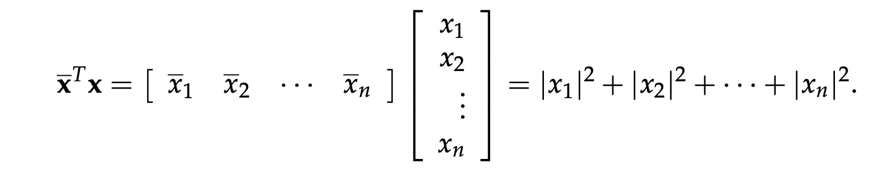
>
> 因此，只要 $x\ne 0$，则 $\overline{x}^Tx\ne 0$。

**提示：** 处理复数向量和复数值时，乘以其共轭值通常很有帮助。

**同理可得：** 当且仅当 $A=\overline{A}^T$ 时，复对称矩阵也会有实数特征值与正交特征向量。（证明过程类似。）

### 对称矩阵是正交投影矩阵的组合

对于对称矩阵 $A$，我们可以得到：

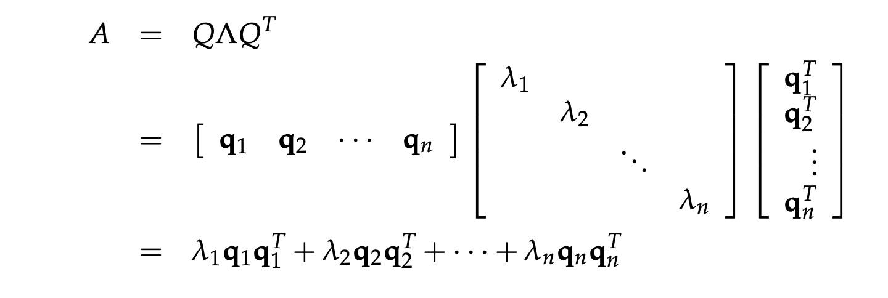

已知标准正交矩阵 $Q$ 的投影矩阵为 $P=QQ^T$，因此此处每一项的 $q_kq_k^T$ 可以看作是 $q_k$ 上的投影矩阵。因此每一个对称矩阵都可以看作是**正交投影矩阵的组合**。

### 特征值的数量与枢轴的数量

对于一个巨大的**对称矩阵**，我们很难直接计算其特征值，但计算其枢轴是较为容易的，这时我们可以根据以下定理来寻找该矩阵的特征值特征：

**正枢轴的数量 = 正特征值的数量**

> **如何由矩阵特征值的符号数量来寻找其特征值的分布特征**
>
> 我们已经知道了寻找矩阵特征值正负数量的方法。因此对于矩阵 $A+bI$，若矩阵 $A$ 的特征值为 $\lambda_i$，则 $A+bI$ 的特征值大小等于 $\lambda_i+b$。
>
> 若特征值为正，$\lambda_i+b>0 \to \lambda_i>-b$
>
> 因此我们可以找到矩阵 $A$ 特征值大于 $-b$ 的数量。

# 线性代数中的复数（Complex）

复数矩阵是我们不可避免会遇到的，因为即使一个全为实数的矩阵，其特征值也可能是复数（例如 Unit 2.5 提到的将向量旋转 90° 的非对称实数矩阵 $Q$）。

## 复数向量（Complex Vectors）

### 复数向量的长度（模）

给定向量：$z=\begin{bmatrix} z_1 \\ z_2 \\ \vdots \\ z_n \end{bmatrix}\in \mathbb{C}^n$

若我们使用实数向量的方式计算向量长度，即

$z^Tz=\begin{bmatrix} z_1 & z_2 & \dots & z_n \end{bmatrix}\begin{bmatrix} z_1 \\ z_2 \\ \vdots \\ z_n\end{bmatrix}$，

我们可能得到：

$\begin{bmatrix} 1 & i \end{bmatrix}\begin{bmatrix} 1 \\ i \end{bmatrix}=0$

我们不希望复数向量的长度为 0，因此我们定义复数向量长度为其**共轭向量**的装置与原向量的点乘：

$\boxed{|z|^2=\overline{z}^Tz=|z_1|^2+|z_2|^2+\dots+|z_n|^20}$

此时，上述向量的长度计算可得：$(\text{length}\begin{bmatrix} 1 \\ i \end{bmatrix})^2=\begin{bmatrix} 1 & -i \end{bmatrix}\begin{bmatrix} 1 \\ i \end{bmatrix}=2$

为此，我们有一个简化的符号来表示共轭转置：$z^H=\overline{z}^T$

因此，复数向量的长度定义为：$\boxed{|z|^2=z^Hz}$

> “$z^H$” 的 $H$ 来自名字 Hermite。我们将 $z^Hz$ 操作读作 “$z$ Hermitian $z$”（将 Hermite 变形为形容词以修饰向量 $z^H$）。

### 复数向量的内积（点积）

相似地，计算复数向量的内积时，我们也应该用 Hermite 代替简单的转置：

$y^Hx=\overline{y}^Tx=\overline{y}_1x_1+\overline{y}_2x_2+\dots+\overline{y}_nx_n$

## 复数矩阵（Complex Matrices）

### Hermitian 矩阵（类比对称矩阵）

对称矩阵的性质是：$A^T=A$

若 $A$ 是复数矩阵，那么为了得到和对称矩阵相同的特征值特性（1. 所有特征值为实数；2. 特征向量两两正交），我们只需将具有对称矩阵的性质修改为：

$A^H=\overline{A}^T=A$

具有这个性质的矩阵称作 **Hermitian 矩阵**（与对称矩阵做区分）。

例如：

$\overline{A}^T=A=\begin{bmatrix} 2 & 3+i \\ 3-i & 5 \end{bmatrix}$

**注意：** Hermitian 矩阵的对角线必须为实数。

### 幺正矩阵（Unitary Matrices；类比正交矩阵）

已知标准正交（Orthonormal）的定义是不同的向量两两点乘为 0；相同的向量两两点乘为 1。

对于复数向量，根据复数向量的点积定义，其正交定义应该如下：

$\overline{\textbf{q}}_j^T\textbf{q}_k = \left\{ \begin{array}{cl} 0 & : \ j \ne k \\ 1 & : \ j=k \end{array} \right.$

将符合上述定义的标准正交向量（设他们的维度均为 $n$，因此组成的矩阵是**方阵**）组成矩阵 $Q$，我们可以得到 $Q^HQ=I$。类似于正交矩阵的性质。我们将此矩阵称作**幺正矩阵**（与正交矩阵做区分）。

# 傅里叶变换（Fourier Transform）

## 离散傅里叶变换（Discrete Fourier Transform，DFT）

在正交的应用中，我们了解到傅里叶级数可以将任意连续的周期函数做无穷的展开。

而对于有限长度的离散信号，我们需要使用离散傅里叶变换，其可以将长度为 $n$ 的向量变换到频域，通过一个傅里叶矩阵 $F_n$：

$X=F_nx$

接下来会详细研究这个傅里叶矩阵。

### 傅里叶矩阵（Fourier Matrix）

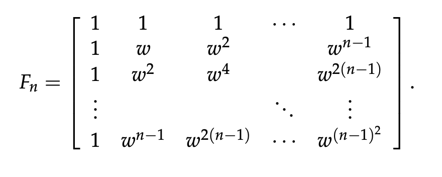

以上为傅里叶矩阵的定义。经过观察我们可得其性质：

- 傅里叶矩阵是**对称矩阵**（虽然这是复数矩阵，但并不是 Hermitian 矩阵），$F_n=F_n^T$。
- $(F_n)_{jk}=w^{jk},\ \text{where}\ j,k=0,1,\dots,n-1$。

> **关于傅里叶矩阵的元素 $w$**
>
> 傅里叶矩阵的元素 $w$ 是基本旋转因子，
>
> 其值为 $w=e^{i\cdot \frac{2\pi}{n}}$ （由欧拉公式 $e^{i\theta}=\text{cos}\theta+i\text{sin}\theta$ 可得 $w=e^{i\cdot \frac{2\pi}{n}}=\text{cos}(\frac{2\pi}{n})+i\text{sin}(\frac{2\pi}{n})$），
>
> 因此 $w^n=1$。

- 傅里叶矩阵的列是**正交**的（不同列的复数向量两两内积为 0）。由于每一列复数向量的长度都为 $\sqrt{n}$，归一化后，我们可以得到**幺正矩阵**：$\frac{1}{\sqrt{n}}F_n$ （$\frac{1}{n}F_n^HF_n=I$）。

### 傅里叶矩阵的最佳例子

当 $n=4$ 时，由于 $w^4=1$ 并且 $w=e^{\frac{2\pi i}{4}}=i$，我们可以得到以下矩阵：

$F_4=\begin{bmatrix} 1 & 1 & 1 & 1 \\ 1 & i & i^2 & i^3 \\ 1 & i^2 & i^4 & i^6 \\ 1 & i^3 & i^6 & i^9 \end{bmatrix}=\begin{bmatrix} 1 & 1 & 1 & 1 \\ 1 & i & -1 & -i \\ 1 & -1 & 1 & -1 \\ 1 & -i & -1 & i \end{bmatrix}$

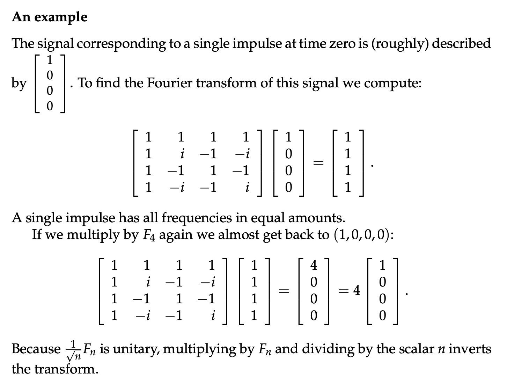

## 快速傅里叶变换（Fast Fourier Transform, FFT）

对于离散傅立叶变换，当 $n$ 较大时，我们需要计算的次数较多，但是借助 FFT 可以将 $F_n$ 分解以实现计算量的指数级降低。

$F_{2n}=\begin{bmatrix} I & D \\ I & -D \end{bmatrix}\begin{bmatrix} F_n & 0 \\ 0 & F_n \end{bmatrix}P$

$D$ 与 $P$ 分别是一个对角线矩阵与一个排列矩阵。

因此对于 $F_{n}$ 矩阵原先 $n^2$ 的计算量，由于每次分解 $F_n$ 会缩减二分之一（直到最小的矩阵 $F_2$），因此可以将分解过程看作一个满二叉树，此二叉树有 $\text{log}_2n$ 层，其中每一层都会运算 $\frac{1}{2}n$ 次，因此总运算次数为 $\frac{1}{2}n\text{log}_2n$。

> **使用例子展现快速傅里叶变换的高效**
>
> 假设 $n=1024=2^{10}$，那么 $F_n$ 需要 $n^2$ 即近百万次运算。而使用快速傅里叶变换分解后，我们需要的计算次数是 $\frac{1}{2}n\text{log}_2n=5\times 1024$ 次，快了近 200 倍。

# 正定矩阵（Positive Definite Matrices）

定义：所有**特征值**均为**正数**的**对称矩阵**。

属性：

1. 所有的**特征值**为正数
2. （推论）所有的**枢轴**为正数（依据本单元对称矩阵小节提到的对称矩阵的性质）。
3. （推论）所有的**子行列式**（sub-determinants，即从矩阵左上角开始，第 $1\times 1$ 大小的行列式、第 $2\times 2$ 大小的行列式……第 $n\times n$ 大小的行列式）为正数。

**提示：** 通过计算对称矩阵的全部枢轴的符号，可以轻松地判断此矩阵是否是正定矩阵。

## 使用二次型多项式检验正定矩阵

检查一个对称矩阵是否是正定矩阵，除了检查特征值、枢轴以及子行列式以外，还可以检验其**二次型（Quadratic Form）** 是否对于任意未知数都为正。

二次型通过计算 $x^TAx$ 得到，其中，$A$ 是我们需要检验的对称矩阵，$x$ 是一个 $n\times 1$ 的未知数向量（如 $\begin{bmatrix} x_1 \\ x_2 \end{bmatrix}$）。

**示例**

对于一个 $2\times 2$ 矩阵：

$\begin{bmatrix} 2 & 6 \\ 6 & y \end{bmatrix}$

通过检验其行列式我们可知，当 $2y-36\gt0$ ，即 $y\gt18$ 时这是一个正定矩阵。

$y=18$ 是一个关键的分界点，矩阵：

$\begin{bmatrix} 2 & 6 \\ 6 & 18 \end{bmatrix}$

虽然不是一个正定矩阵，但是因为其正好位于正定矩阵与非正定矩阵的分界点（一个行列式为 0 的矩阵），我们称其为**正半定矩阵（Positive Semi-definite Matrix）**。

正半定矩阵是一个奇异矩阵，且拥有大于等于 0 的特征值。因为这是一个奇异矩阵，所以它的行列式为 0，且只有一个枢轴（对于 $2\times 2$ 矩阵）。

这个正半定矩阵的二次型为：

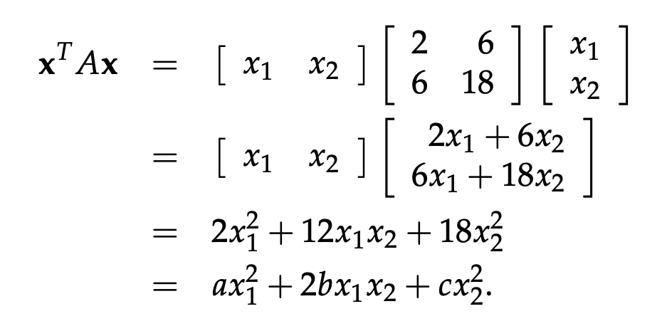

我们将得到的二次型格式化为 $ax_1^2+2bx_1x_2+cx^2_2$。

我们将这个二次型使用代数的方式变换为几个平方项相加后得到：

$2(x_1+3x_2)^2=0,\ when\ x_1=3,\ x_2=-1$

### 检查二次型函数的最小值

对于一个二次型，想知道其是否对于任何未知数都为正，我们应该检查其函数的最小值。

**示例 1：非正定矩阵的二次型**

给定矩阵：

$\begin{bmatrix} 2 & 6 \\ 6 & 7 \end{bmatrix}$

我们从上文已知右下角的元素为 18 时，这将是一个正半定矩阵。此时这个元素小于 18，那么它应该是非正定矩阵。

其二次型化简后得到：$2x^2+12xy+7y^2=2(x+3y)^2-11y^2$

（现在我们使用 $x,y$ 来表示未知数，二次型的未知数可以使用任意字母表示。）

可以看出这个平方多项式不一定在任何情况下都为正。

其二次型函数为：$f(x,y)=2x^2+12xy+7y^2$ 

这个函数图像会在原点处有一个鞍点。因此它的最小值是小于 0 的。

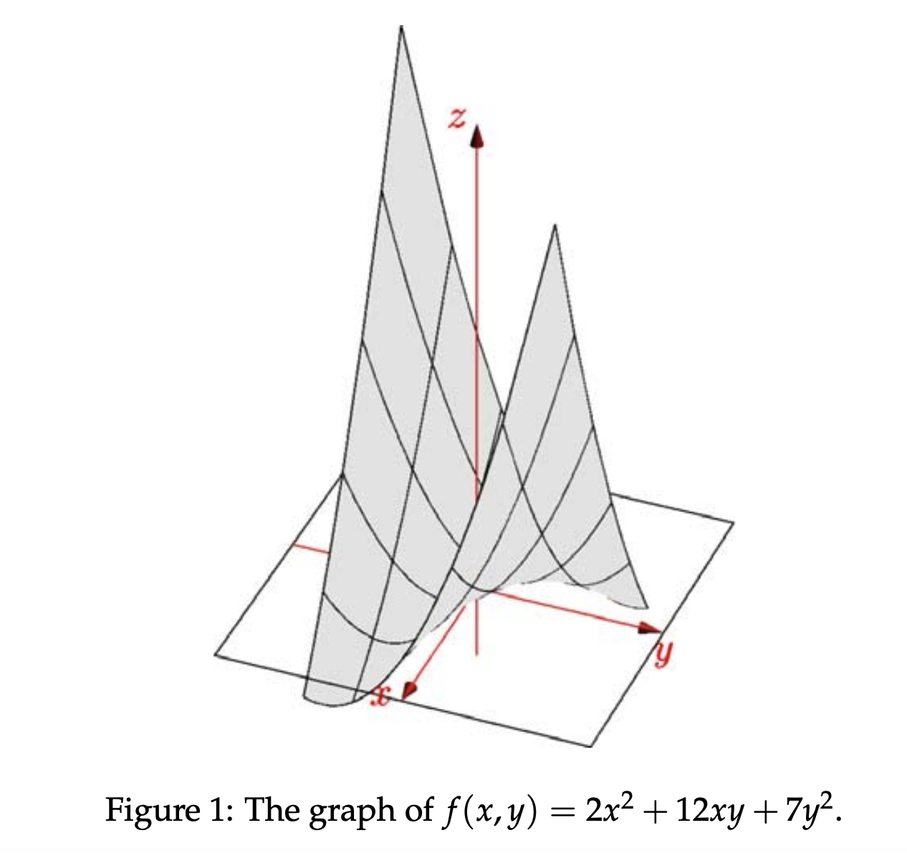

**示例 2：正定矩阵的二次型**

现在给定矩阵：

$\begin{bmatrix} 2 & 6 \\ 6 & 20 \end{bmatrix}$

其二次型为：$2x^2+12xy+20y^2=2(x+3y)^2+2y^2$

将得到的平方多项式比较上文提到的正半定矩阵的多项式：

$2x^2+12xy+18y^2=2(x+3y)^2$

我们可以发现对于右下角元素为 20 的矩阵，其二次型函数只有在 $(0,0)$ 点才为 0，函数图像如下：

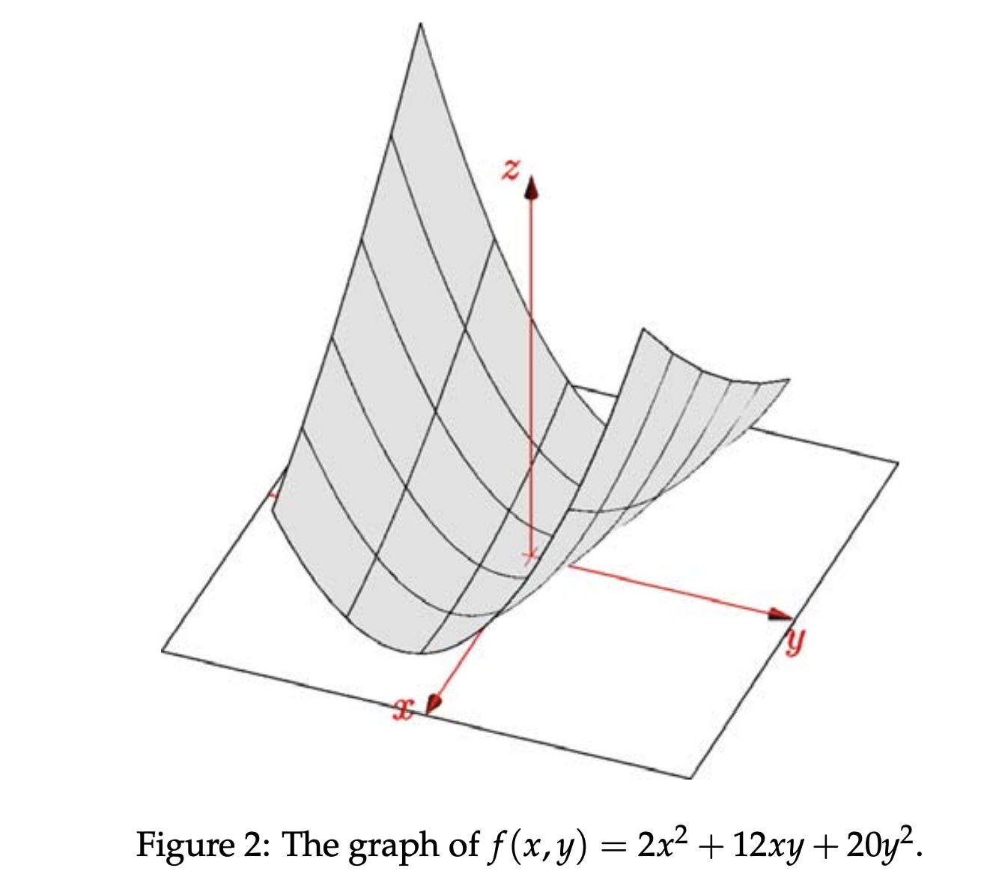

其最小值在原点。

### 二次型平方多项式的系数与高斯消除法

二次型化简后得到的平方多项式的系数其实与高斯消除法得到的矩阵元素由关。

对于矩阵：

$\begin{bmatrix} 2 & 6 \\ 6 & 20 \end{bmatrix}$

我们知道其二次型：$2x^2+12xy+20y^2=2(x+3y)^2+2y^2$

对矩阵做高斯消除法，得到 $U$ 与 $L$ 为：

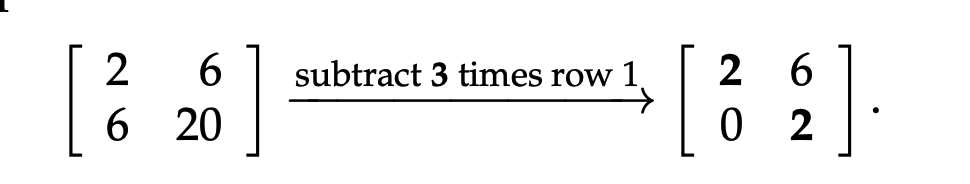

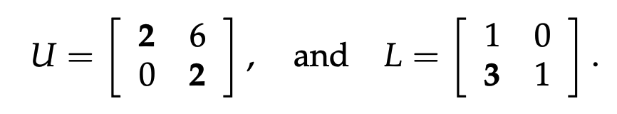

**发现：** 多项式的系数是上三角矩阵的枢轴；项 $(x-cy)^2$ 的系数 $c=3$ 是第二行减去第一行的倍数。

> 我们知道当二次型的平方多项式的系数全为正，二次型为正，说明这是正定矩阵。而多项式的系数正好是矩阵的枢轴。这对应了正定矩阵的属性：**所有的枢轴为正**。

## 黑塞矩阵（Hessian Matrix，二次导数矩阵）

在微积分中我们了解到：对于一个二元函数 $f(x,y)$，若其在点 $(x_0,y_0)$ 的二阶导数测试 $f_{xx}f_{yy}>f_{xy}^2$ 成功，则该点是局部最小值点。

实际上，$f_{xx}f_{yy}>f_{xy}^2$ 源于黑塞矩阵的行列式。

函数 $f(x,y)$ 的黑塞矩阵（二次导数矩阵）为：

$\begin{bmatrix} f_{xx} & f_{xy} \\ f_{yx} & f_{yy} \end{bmatrix}$

因为 $f_{xy}=f_{yx}$，所以这是一个对称矩阵。

当黑塞矩阵为正定矩阵时（其行列式为正），可以检验为最小值点。

## 正定矩阵的变形

假设正定矩阵 $A$，我们可以验证以下变形仍然为正定矩阵。

### $A^{-1}$

我们已知逆矩阵的特征值是原矩阵特征值的倒数。正定矩阵 $A$ 的特征值为正，其倒数仍为正，因此 $A^{-1}$ 是正定矩阵。

### $A+B$

已知 $A$  与 $B$ 都是正定矩阵，那么它们的和也是正定矩阵。

可以使用二次型进行验证。

已知 $x^TAx\gt0$ 和 $x^TBx\gt0$，$x^T(A+B)x=x^TAx+x^TBx\gt0$

### $A^TA$

设 $A$ 是一个长方形矩阵 $m\times n$，那么 $A^TA$ 是一个方阵而且对称。

$x^T(A^TA)x=(Ax)^T(Ax)=|Ax|^2\ge0$

若 $A^TA$ 是正定矩阵，我们还需要确保只有 $x$ 为 0 时，$x^T(A^TA)x$ 才为 0，即 $Ax=0$ 的零空间只有零向量。因此，根据零空间的特征，我们知道若 $A$ 是秩满列（$r(A)=n$），则零空间只有零向量，此时 $A^TA$ 是正定矩阵。

# 相似矩阵（Similar Matrices）

若两个方阵 $A$ 与 $B$，给定某个矩阵 $M$，满足 $B=M^{-1}AM$，则称 $A$ 与 $B$ 相似（similar）。 

## 相似矩阵具有相同特征值

两个相似矩阵 $A$ 与 $B$ 具有相同的**特征值**与相同的**独立特征向量数量**（独立的特征向量数与特征值有关）。

**证明**

已知 $B=M^{-1}AM$

设 $Ax=\lambda x$

$AMM^{-1}x=\lambda x$

$M^{-1}AMM^{-1}x=\lambda M^{-1}x$   *两边同时左乘 $M^{-1}$*

$BM^{-1}x=\lambda M^{-1}x$

此时，我们可以发现 $B$ 的特征值为 $\lambda$，特征向量为 $M^{-1}x$。

## 相似矩阵的对角化

若矩阵 $A$ 可对角化（有 $n$ 个独立的特征向量），那么对角化矩阵 $\Lambda$ 也与这个矩阵相似，且与这个矩阵的整个家族（家族里的每个矩阵都互相相似）都相似。

设 $A$ 的特征向量矩阵 $S$，我们知道：

$S^{-1}AS=\Lambda$

满足相似矩阵的定义。

> **不可对角化的矩阵的相似性**
>
> 若 $A$ 的两个特征值是相同的，也许这个矩阵无法被对角化。
>
> 设 $\lambda_1=\lambda_2=4$，我们可以写出以下两种矩阵：
>
> $\begin{bmatrix} 4 & 0 \\ 0 & 4 \end{bmatrix}$ 与 $\begin{bmatrix} 4 & 1 \\ 0 & 4 \end{bmatrix}$
>
> 第一种矩阵的家族只包含这一个矩阵，而第二种矩阵的家族包含了更多的矩阵。
>
> 对于第一种矩阵，其为**单位矩阵**的倍数矩阵，则将其代入相似矩阵定义式会的得到：
>
> $M^{-1}\begin{bmatrix} 4 & 0 \\ 0 & 4 \end{bmatrix}M=4M^{-1}M=\begin{bmatrix} 4 & 0 \\ 0 & 4 \end{bmatrix}$

## Jordan 标准型（Jordan Normal Form）

每个相似矩阵的家族一定都与一种对应的 Jordan 标准型相似。

Jordan 标准型是一种相似矩阵家族里最近似对角线矩阵的矩阵。

若两个矩阵即使特征值相同，但其 Jordan 标准型不同，那这两个矩阵一定不是相似矩阵。

 Jordan 标准型矩阵表示如下：

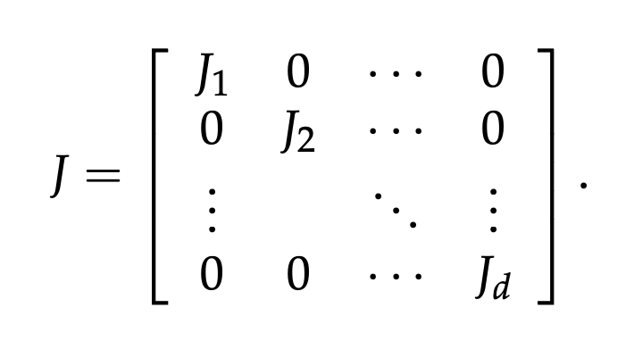

其中，$J_i$ 表示一个 Jordan 块。

对于一个矩阵，我们可以将其分为一个或多个 Jordan 块，每个 **Jordan 块**是一个方阵，其特征为：对角线上是相同的元素，且这个元素为特征值（即有 $n$ 个重复特征值）；对角线以下以及方阵右上角由 0 填充；对角线上方全为 1。如：

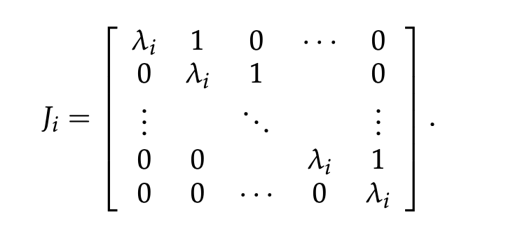

且每个 Jordan 块都有一个独立的特征向量（Jordan 块的对角线元素全是相同的特征值）。

现在我们对以下两个矩阵划分块：

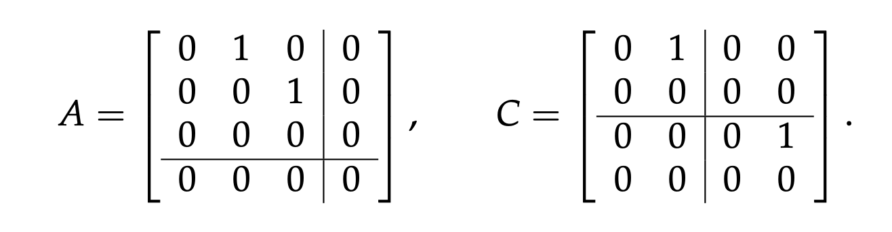

可以看到它们的 Jordan 块大小不同，因此即使它们的特征值相同（都为 0）且都为两个独立的特征向量（因为特征值为 0，矩阵的零空间等于特征向量，因为秩为2，零空间的特解个数 $n-r=2$ 即独立的特征向量个数），这两个矩阵依然不是相似矩阵。

> **对于可对角化矩阵的 Jordan 标准型**
>
> 可对角化矩阵一定与 $\Lambda$ 相似。Jordan 标准型是家族里最接近对角线矩阵的相似矩阵，因此任何可对角化矩阵的 Jordan 标准型都是其对角化分解后的特征值矩阵 $\Lambda$。

# 奇异值分解（Singular Value Decomposition, SVD）

回顾矩阵的分解：借助高斯消除法，我们可得到 $A=LU$ 分解；借助 Gram-Schmidt 正交法，我们可以得到 $A=QR$ 分解；借助矩阵的对角化，我们可以得到 $A=S\Lambda S^{-1}$ 分解。
而此处将介绍的奇异值分解（或称作 SVD 分解）是最后一种矩阵分解方法，也是矩阵的最佳分解。
$$A=U\Sigma V^T$$
*其中，$U\in \mathbb{R}^{m\times m}$ 是正交矩阵，$\Sigma\in \mathbb{R}^{m\times n}$ 是对角线矩阵，$V\in \mathbb{R}^{n\times n}$ 也是正交矩阵。*

## 对称矩阵的奇异值分解

若 $A$ 是对称矩阵，其特征向量是正交的。我们在对称矩阵小节中由矩阵的对角线分解得到了 $A=Q\Lambda Q^T$。此处的分解可以看作奇异值分解的特殊情况，此时 $U=V=Q$。

## 奇异值分解的推导

设向量 $v_{1}$ 在矩阵 $A$ 的行空间中，那么向量 $u_{1}=Av_{1}$ 则在矩阵的列空间中。

对于 SVD 分解，要求从行空间中寻找一组正交基，然后将其转换为在列空间的一组正交基。
所以，若 $v_{i}$ 是行空间的标准正交基且 $u_{i}$ 是列空间的标准正交基，那么我们可以得到 $Av_{i}=\sigma_{i}u_{i}$，其中标量 $\sigma$ 用于将标准正交向量 $u_{i}$ 缩放为 $v_{i}$ 在列空间转换后的向量。

> **请注意：** 我们不能直接使用 Gram-Schmidt 正交法寻找 $v_{i}$。因为使用此方法寻找到的正交向量组只满足正交归一这一个条件，而不一定能将其变换为列空间向量 $u_{i}$。

将上述向量组使用矩阵表示：

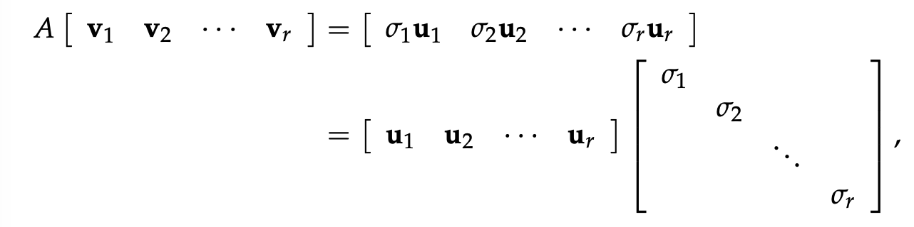

因为行空间（与列空间）中独立的向量数量为 $r$，因此我们可以得到 $r$ 个正交归一向量作为 $V$ 与 $U$。

另外，矩阵的零空间维度为 $n-r$，因此我们有 $v_{r+1},\dots,v_n$ 作为 $A$ 的零空间，对应的 $\sigma_{r+1},\dots,\sigma_n$ 也为 0。

因此矩阵 $\Sigma$ 的前 $r$ 行的对角线应为非 0 值，而后 $n-r$ 行应全为 0。

得到矩阵式：$AV=U\Sigma$。

> 因为 $U$ 和 $V$ 都有 $r$ 个线性独立的向量，因此它们分别是矩阵行空间与列空间的基。若矩阵是对称矩阵，那么它的行空间与列空间相同（因为 $U=V=Q$）。

## $U$、 $V$ 与 $\Sigma$ 的计算

设可逆矩阵 $A=\begin{bmatrix} 4 & 4 \\ -3 & 3 \end{bmatrix}$

我们希望寻找其 $v_1$，$v_2$ 与 $u_1$，$u_2$，以及正数 $\sigma_1$，$\sigma_2$。

我们知道 $AV=U\Sigma$，即 $A=U\Sigma V^T$。

已知 $A^T=V\Sigma^TU^T$

将 $A=U\Sigma V^T$ 两边同时左乘 $A^T$，可得：

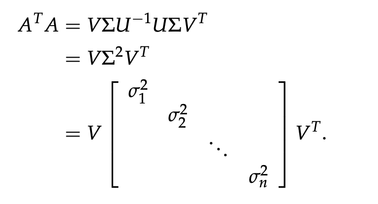

我们发现该形式符合 $Q\Lambda Q^T$。因此 $V$ 的每一列都是矩阵 $A^TA$ 的特征向量，而 $\sigma_i^2$ 是矩阵 $A^TA$ 的特征值。

使用相似的方式，我们计算 $AA^T=U\Sigma^2U^T$ 可以进一步求出 $U$。

### SVD 计算示例

对于矩阵 $A=\begin{bmatrix} 4 & 4 \\ -3 & 3 \end{bmatrix}$

我们计算 $A^TA$：

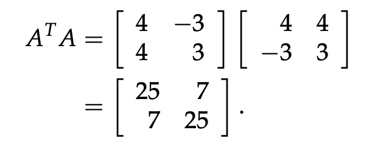

由 $det(A-\lambda I)=0$ 计算得特征值为 $\lambda_1=\sigma_1^2=32,\ \lambda_2=\sigma_2^2=18$；特征向量为 $\begin{bmatrix} 1 \\ 1 \end{bmatrix}$ 与 $\begin{bmatrix} 1 \\ -1 \end{bmatrix}$，为了得到正交归一基，我们将两个特征向量归一化得到：$\begin{bmatrix} 1/\sqrt{2} \\ 1/\sqrt{2} \end{bmatrix}$ 与 $\begin{bmatrix} 1/\sqrt{2} \\ -1/\sqrt{2} \end{bmatrix}$

此时我们已经得到矩阵 $\Sigma$ 与 $V$：

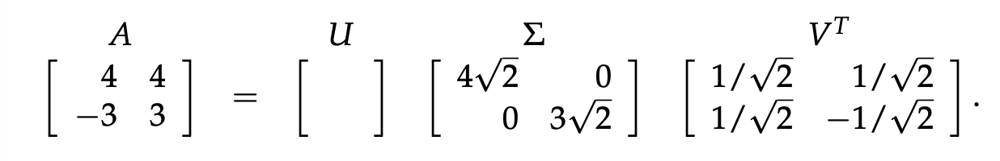

接下来为了得到 $U$，我们计算 $AA^T$：

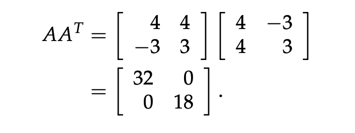

$AA^T$ 的特征值应与 $A^TA$ 相同，我们可以二次检查特征值的计算。

然后计算特征向量得到矩阵 $U$：

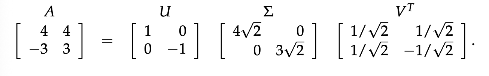

### 带有零空间的 SVD 计算示例

现在设 $A=\begin{bmatrix} 4 & 4 \\ 8 & 6 \end{bmatrix}$

这是一个奇异矩阵，拥有一维零空间与一维行空间和列空间。

因为其行空间是向量 $\begin{bmatrix} 4 \\ 3 \end{bmatrix}$ 的倍数，可得 $v_1=\begin{bmatrix} 0.8 \\ 0.6 \end{bmatrix}$ 

其列空间是向量 $\begin{bmatrix}4 \\8\end{bmatrix}$ 的倍数，可得 $u_1=\begin{bmatrix} 1/\sqrt{5} \\ 2/\sqrt{5} \end{bmatrix}$

为了计算 $\sigma_1$，我们需要寻找 $A^TA$（或 $AA^T$）的非零特征值：

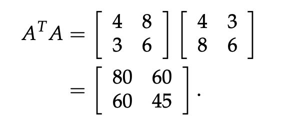

已知一个特征值为 0，根据矩阵的迹，另一个特征值为 $\sigma_1^2=125$。

可得矩阵 $A$ 的 SVD 如下：

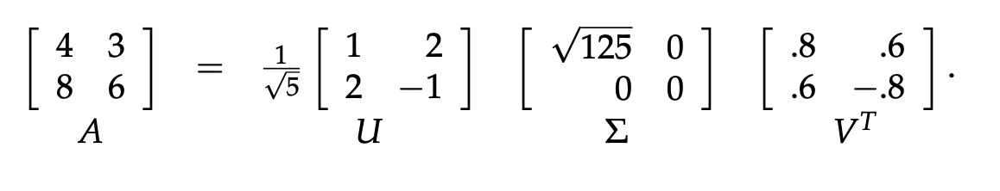

## $u_i$ 与 $v_i$ 不同范围的意义

根据 $Av_i=\sigma_iu_i$，我们可得：

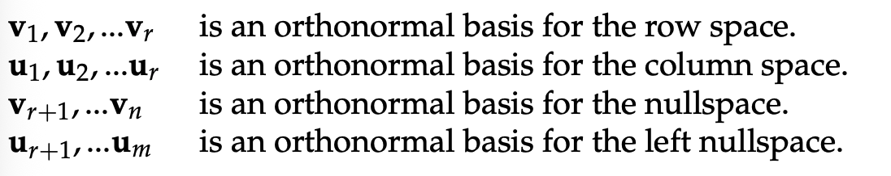

注意：$\sigma_{r+1},\dots,\sigma_n$ 为 0。

> **关于左零空间**
>
> 将 $Av_i=\sigma_iu_i$ 变形可得：$u_i^TA=\sigma_iv_i^T$
>
> 当 $\sigma_i$ 为 0 时，根据定义 $u_i$ 是 $A$ 的左零空间。

# 线性变换（Linear Transformations）

虽然这是首次对线性变换进行介绍，但是第二单元的概念——**投影**——就是一种线性变换。
投影将每个在 $\mathbb{R}^2$ 中的向量变换为 $\mathbb{R}^2$ 中的另一个向量，此变换操作使用数学符号表示为：$T:\mathbb{R}^2\to \mathbb{R}^2$。

##  线性变换的定义

并不是所有的变换操作都是线性变换，只有满足下列条件（线性定义）的可以被定义为线性变换：
- $T(v+w)=T(v)$
- $T(cv)=cT(v)$   *推论：$T(0)=0$*
- $T(cv+dw)=cT(v)+dT(w)$

**反例：非线性变换**

1. $T(v)=v+v_{0}$
此变换将平面上的每一个向量与一个固定的向量 $v_{0}$ 相加。因为 $T(2v)=2v+v_{0}\ne 2T(v)$，所以其不是线性变换。

2. $T(v)=||v||$
此变换将任何向量转换为它的模长。因为当 $c\lt_{0}$ 时 $T(cv)\ne cT(v)$，因此这不是线性变换。

**线性变换例子**

设一个变化 $T:\mathbb{R}^2\to \mathbb{R}^2$ 会将所有输入的向量 $v$ 关于原点逆时针旋转 45°。虽然这个变换暂时没有使用数学公式进行表示，但是借助语言描述，可以发现这是一个线性变换。

## 使用矩阵表示线性变换

我们可以借助矩阵来表示任意线性变换，如 $T(v)=Av$。线性变换可以认为是**矩阵乘法**的一种抽象解释。
对于使用矩阵表示的线性变换，我们可以如下表示其线性定义：
- $T(v)=Av$
- $T(v+w)=A(v+w)=Av+Aw$
- $T(cv)=cAv$

### 分析变换矩阵

给定变换矩阵 $A=\begin{bmatrix}1 & 0\\0 & -1\end{bmatrix}$，在几何上如何解释变换 $T(v)=Av$？
向量 $v$ 是一个二维向量，因此其可以表示为 $v=\begin{bmatrix}x\\y\end{bmatrix}$，$Av$ 相乘后会得到 $x$ 不变，而 $y$ 符号取反的新向量。
因此这个变换将向量关于 $x$ 轴翻转。

> **变换维度的矩阵**
> 
> 如果我们想要找到线性变换 $T:\mathbb{R}^3\to \mathbb{R}^2$ 对应的变换矩阵，即将三维空间的向量变换到二维空间，
> 我们应该选择一个 2 行 3 列的矩阵 $A$，并定义 $T(v)=Av$。

## 使用基表示线性变换

对于一个变换，它的输入向量可以从某个维度的实数空间任意选取。如果我们希望使用公式的方式记录任意向量的变换结果，可以借助该向量空间的一组基。

例如，变换 $T$ 在 $\mathbb{R}^n$ 上作用，因此所有的输入向量都位于空间 $\mathbb{R}^n$。
若这个空间的一组基为：$v_{1},v_{2},\dots,v_{n}$
那么该空间内的任意的向量都可以写为这组基的线性组合：$v=c_{1}v_{1}+c_{2}v_{2}+\dots+c_{n}v_{n}$

根据线性变换的定义，我们可以将变换 $T(v)$ 表示为：
$$T(v)=c_{1}T(v_{1})+c_{2}T(v_{2})+\dots+c_{n}T(v_{n})$$

> **基与坐标的关系**
> 
> 上述这组基的系数 $c_{1},c_{2},\dots,c_{n}$ 代表着坐标。
> 因此我们常使用的坐标就来自于一组基；当这组基被改变，那么坐标也会发生变动。

## 改变向量的基（Change of Basis）

假设在一个二维坐标系 $(x,y)$ 中，我们的标准基是 $\begin{bmatrix}1\\0\end{bmatrix}$ 与 $\begin{bmatrix}0\\1\end{bmatrix}$。如果一个向量从原点指向坐标点 $(3,4)$，其值为 $\begin{bmatrix}3\\4\end{bmatrix}$。虽然这个向量的数值很符合直觉，但实际上这个向量是经过以下计算后得到的：
$$\begin{bmatrix}3\\4\end{bmatrix}=3\begin{bmatrix}1\\0\end{bmatrix}+4\begin{bmatrix}0\\1\end{bmatrix}$$
现在若我们希望变换此向量的基，那我们只需要定义一个线性变换 $T:\mathbb{R}^2\to \mathbb{R}^2$，由线性变换的定义，可以得到：
$$T(v)=c_{1}T(v_{1})+c_{2}T(v_{2})+\dots+c_{n}T(v_{n})$$
其中 $n$ 为向量空间的维度。代入开始的例子，可得：
$$T(\begin{bmatrix}
3\\4
\end{bmatrix})=3T(\begin{bmatrix}
1\\0
\end{bmatrix})+4T(\begin{bmatrix}
0\\1
\end{bmatrix})$$
现在我们所需要做的仅是构建一个变换矩阵 $A$，将旧的基变换为新的基。

### 构建变换矩阵

假设我们要实现变换 $T:\mathbb{R}^n\to \mathbb{R}^m$，我们需要对这两个空间各选择一组基：
$v_{1},v_{2},\dots,v_{n}$ 是 $\mathbb{R}^n$ 的基；$w_{1},w_{2},\dots,w_{m}$ 是 $\mathbb{R}^m$ 的基。

变换矩阵 $A$ 的第 $i$ 列对应着输出向量 $T(v_{i})$ 的系数。
$$A=\begin{bmatrix} a_{11} & \dots & a_{1n} \\ \vdots & \ddots & \vdots \\ a_{m1} & \dots & a_{mn} \end{bmatrix}$$
因此：$T(v_{i})=a_{{1i}}w_{1}+a_{{2i}}w_{2}+\dots+a_{{mi}}w_{m}$

# 左逆（Left Inverse）、右逆（Right Inverse）与伪逆（Pseudoinverse）

在第一单元，已经充分介绍了逆操作（Inverse），实际上其更准确的命名是**双向逆（2-sided Inverse）**。双向逆要求矩阵 $A$ 必须满足 $r=m=n$，即行与列全满秩。

从线性变换角度，对于全满秩的方阵，$Ax=b$，输入向量 $x$，与输出向量 $b$（或直接表示为 $Ax$）是一一对应的关系。给定向量 $b$，可以通过左乘 $A^{-1}$ 还原 $x$。

下面介绍的几种新的逆操作有着更宽松的要求，矩阵可以不必为方阵且不必全满秩，但无法做到输入与输出一一对应。

## 左逆

当矩阵只满足 $r=n$，即列满秩，此时零空间只包含零向量，方程 $Ax=b$ 要么只有一个解要么无解。
从线性变换角度，虽然 $x$ 与 $Ax$ 是一一映射的关系，但是任意的 $x$ 未必都会得到其对应的输出 $Ax$，即无解。

对于列满秩矩阵，我们可以计算 $A^TA$，其结果是一个 $n\times n$ 的可逆矩阵（因为 $N(A^TA)=N(A)$，当 $A$ 是列满秩，$A^TA$ 为 $n\times n$ 是行列全满秩，因此可逆）。

因此我们可以发现（这只是一个最佳的左逆矩阵，可能存在其他形式的左逆矩阵）：$(A^TA)^{-1}A^TA=I$

设 $A^{-1}_{\text{left}}=(A^TA)^{-1}A^T$ 为**左逆元**。

> **投影矩阵是 $AA^{-1}_{\text{left}}$**
> 
> 将左逆矩阵放在 $A$ 的右侧相乘，得到的不是单位矩阵而是一个新的矩阵。
> $AA^{-1}_{\text{left}}$ 是一个 $m\times m$ 矩阵，其展开为 $A(A^TA)^{-1}A^T$，即投影到 $C(A)$ 的投影矩阵 $P$。

> **当 $m=n=r$ 时左逆矩阵即双向逆矩阵**
> 
> 当矩阵全满秩时，$A^{-1}A=I$。
> 同时，$A^{-1}_{\text{left}}A=I$，因此 $A^{-1}=A^{-1}_{\text{left}}$。

## 右逆

当矩阵只满足 $r=m$，即行满秩，此时左零空间只包含零向量，而零空间可能只有零向量（$m=n=r$），也可能有无穷多的向量（$n>m=r$），方程 $Ax=b$ 要么只有一个解要么无穷解。
从线性变换角度，任意的输入 $x$ 都会得到一个输出 $Ax$，但是可能存在多个 $x$ 对应同一个 $Ax$ 的情况（因为有无穷多的解），因此 $x$ 与 $Ax$ 不是一一对应的。
所以引入右逆元，右乘矩阵 $A$。

类似于左逆，一个最佳的右逆矩阵形式为：$A^{-1}_{\text{right}}=A^T(AA^T)^{-1}$

行满秩的矩阵 $A$ 右乘右逆矩阵结果为单位矩阵。

## 伪逆

伪逆适用于既不行满秩也不列满秩，即 $r<m$ 且 $r<n$ 的矩阵。

这种矩阵的零空间包含非零向量，如果我们想直接寻找其逆矩阵，会得到：

$Ax=0,\ \text{where}\ x\ne 0$
则 $A^{-1}0=x$ 不存在

因此无法对于此类型矩阵无法寻找双向逆。

由于均不满秩的矩阵，$Ax=b$ 的解可能无解（$x$ 属于零空间），或无穷解（$x$ 为特解加零空间的向量）。
因此为了实现双向可逆，引入伪逆矩阵 $A^{+}$，满足 $x=A^{+}Ax$。其中，要求 $x$ 必须在 $A$ 的行空间中。
伪逆矩阵 $A^+$ 的零空间等于 $A$ 的左零空间 $N(A^T)$（暂未证明）。

> **为什么 $x$ 属于 $A$ 的行空间可以使 $x\mapsto Ax$ 可逆** 
> 
> 任意两个属于 $A$ 行空间的向量 $x,y$ 且 $x\ne y$，我们需要证明 $Ax\ne Ay$。即它们在列空间中的映射是一一对应的。由此，我们才可以逆操作这个映射。
> 
> 假设这个命题是假的，那么 $Ax=Ay$，$A(x-y)=0$。所以 $x-y$ 在 $A$ 的零空间中。而因为 $x,y$ 都属于 $A$ 的行空间，因此 $x$ 与 $y$ 只能是零向量，因为行空间与零空间是正交的。
> 但是 $x\ne y$，所以它们不可能同时为零向量，因此这个假设命题是错的，所以原命题为真。

### 寻找伪逆矩阵 $A^+$

借助奇异值分解（SVD）可以便捷地寻找伪逆矩阵。

$A=U\Sigma V^T$

已知 $U$ 与 $V$ 是正交矩阵，$\Sigma$ 是对角线矩阵（前 $r$ 行的对角线上为奇异值，其他位置全为 0）。
所以：$A^+=(U\Sigma V^T)^+=V\Sigma^+U^T$

**计算 $\Sigma^+$**

我们希望 $AA^+$ 的结果为单位矩阵，因此 $\Sigma \Sigma^+$ 的结果应该也为单位矩阵。
当 $r=n=m$，$\Sigma^+=\Sigma^{-1}$，只需将对角线所有值取倒数即可。
当 $r<n,r<m$，$\Sigma^{+}$ 是一个 $n\times m$ 矩阵，其前 $r$ 行的对角线为 $\frac{1}{\sigma_{1}}, \frac{1}{\sigma_{2}},\dots, \frac{1}{\sigma_{r}}$。